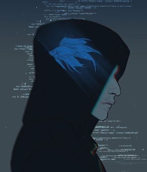
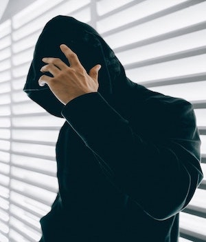

# CTF-writeups

We actively participate in CTFs. These are security competitions which require practical knowledge of topics like binary exploitation, reverse engineering, cryptography, web security,forensics, steganography, etc. We also try to learn many new things in the field of information security and open source and try share our knowledge with everyone.

## Team :  NOOB-ATBASH

|  |  |
| ------------- | ------------- |
|   [ЕЯЯОЯ](https://github.com/Error-200)       |  [kaki-epithesi](https://github.com/kaki-epithesi)|

### LINKS 

For a list of upcoming events and more writeups, see [CTFTIME](https://ctftime.org/event/list/upcoming)

For BLOG - [click](https://noob-atbash.github.io/) 
                            
