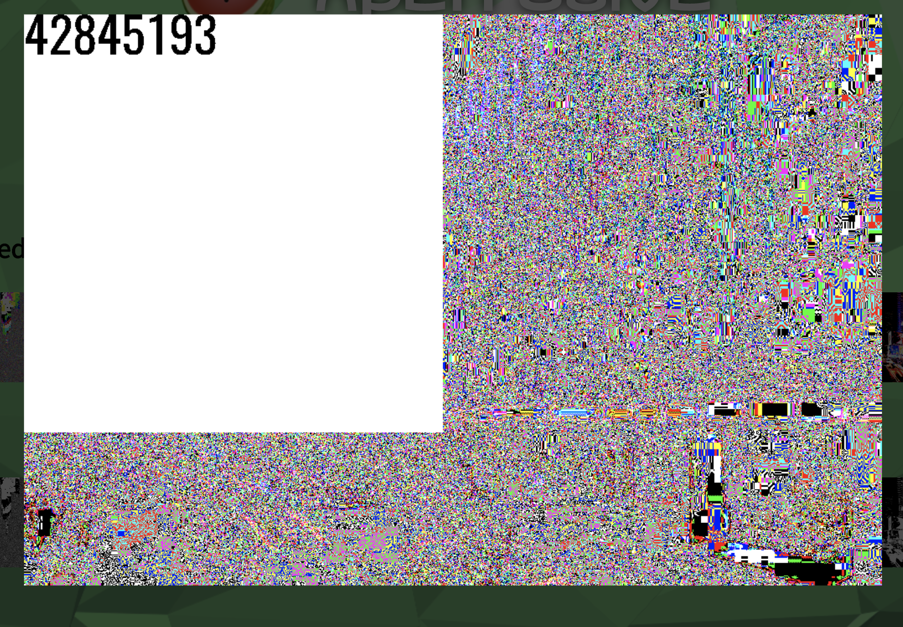
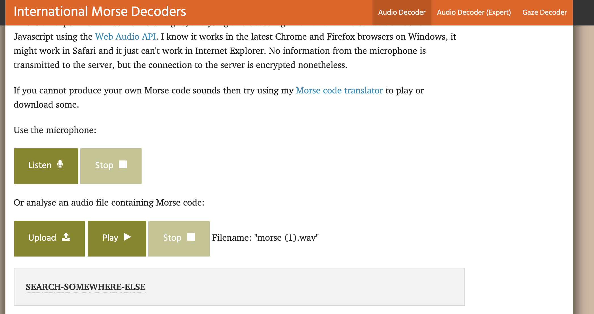
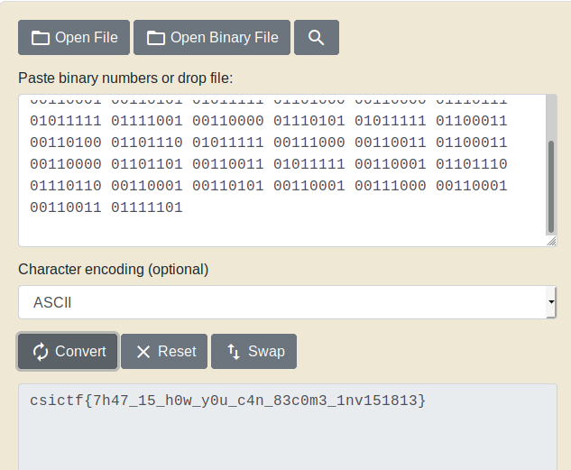

# FORENSIC

## GRADIENT SKY 


The above image was given following the basic commands I got this by binwalk 

```
root@kali:~/ctf/csictf/forensics# binwalk sky.jpg 

DECIMAL       HEXADECIMAL     DESCRIPTION
--------------------------------------------------------------------------------
0             0x0             JPEG image data, JFIF standard 1.01
30            0x1E            TIFF image data, little-endian offset of first image directory: 8
918           0x396           JPEG image data, JFIF standard 1.01
295038        0x4807E         RAR archive data, version 5.x

root@kali:~/ctf/csictf/forensics#
```
As results show it has some RAR content on unraring the content I got the flag

### csictf{j0ker_w4snt_happy}


## ARCHED


As starting with the classical command to check the file formate and it was a .jpg file

```bash
root@kali:~/Desktop# file arched.png
arched.png: JPEG image data, JFIF standard 1.01, resolution (DPI), density 300x300, segment length 16, baseline, precision 8, 1920x1080, components 3
root@kali:~/Desktop#
```
After renaming it .jpg I run some tools and steghide worked perfectly and I got a flag.zip file.

```bash

root@kali:~/Desktop# steghide extract -sf arched.jpg
Enter passphrase:
wrote extracted data to "flag.zip".
root@kali:~/Desktop#

```
Since it was password protected I use fcrack and everyone's fav rockyou.txt to crack it .

```bash
root@kali:~/Desktop# fcrackzip -u -D -p rockyou.txt flag.zip


PASSWORD FOUND!!!!: pw == kathmandu
root@kali:~/Desktop#
```
After unlocking we got a image which have the flag .

## PANDA
In this question we were given a password protected zip file so by using fcrackzip lets crack it . 
```
root@kali:~/Desktop#  fcrackzip -u -D -p rockyou.txt panda.zip


PASSWORD FOUND!!!!: pw == 2611
```

On extracting the zip file we get two panda images at first I tried a loot of tools but it much easier the flag was in the differnce of the strings of the two images so.


```
root@kali:~/Desktop# strings panda1.jpg > p.txt
root@kali:~/Desktop# strings panda.jpg >  q.txt
root@kali:~/Desktop# diff p.txt q.txt

2c2
< $csi

> $3br
93d92
< ctf{
258d256
< kun-
501d498
< Dfu_w
565c562
< p4nd4}

> i$bI

```

From here it was quite frustrating because you need to guess the flag words however I cracked it.

### csictf{kung_fu_panda}


## UNSEEN

This ques have description :

```
With his dying breath, Prof. Ter Stegen hands us an image and a recording. He tells us that the image is least significant, but is a numerical key to the recording and the recording hides the answer. It may seem as though it's all for nothing, but trust me it's not.

```

**FLAG : csictf{7h47_15_h0w_y0u_c4n_83c0m3_1nv151813}**

On downloading the resources we get a image and wav files So from description it is clear that we need to do so using [aperies.fr](https://aperisolve.fr/)  I got the key and on [decoding](https://morsecode.world/international/decoder/audio-decoder-adaptive.html) the wave file as it was a morse code :





So it was clear nothing in audio so I use the extracted key **42845193** to extract data from steghide you can use any online tools also.

```bash
root@kali:~/Desktop# steghide extract -sf morse.wav
Enter passphrase:

wrote extracted data to "flag.txt".

```
I opened the file , it was blank , but there were 88 lines which
were getting selected.
so i saw xxd of the file .
```bash
root@kali:~/ctf/csictf/forensics# xxd flag.txt
00000000: 2020 2009 0920 2020 0909 0d0a 090d 0a20     ..   .......
00000010: 2020 2020 0909 0920 2009 090d 0a09 0d0a      ...  .......
00000020: 2020 2020 2009 0920 0920 2009 0d0a 090d       .. .  .....
00000030: 0a20 2020 2020 0909 2020 2009 090d 0a09  .     ..   .....
00000040: 0d0a 2020 2020 2009 0909 2009 2020 0d0a  ..     ... .  ..
00000050: 090d 0a20 2020 2020 0909 2020 0909 200d  ...     ..  .. .
00000060: 0a09 0d0a 2020 2020 2009 0909 0920 0909  ....     .... ..
00000070: 0d0a 090d 0a20 2020 2020 2009 0920 0909  .....      .. ..
00000080: 090d 0a09 0d0a 2020 2020 2009 0920 0920  ......     .. .
00000090: 2020 0d0a 090d 0a20 2020 2020 2009 0920    .....      ..
000000a0: 0920 200d 0a09 0d0a 2020 2020 2020 0909  .  .....      ..
000000b0: 2009 0909 0d0a 090d 0a20 2020 2020 0920   ........     .
000000c0: 0909 0909 090d 0a09 0d0a 2020 2020 2020  ..........      
000000d0: 0909 2020 2009 0d0a 090d 0a20 2020 2020  ..   ......     
000000e0: 2009 0920 0920 090d 0a09 0d0a 2020 2020   .. . ......    
000000f0: 2009 2009 0909 0909 0d0a 090d 0a20 2020   . ..........   
00000100: 2020 0909 2009 2020 200d 0a09 0d0a 2020    .. .   .....  
00000110: 2020 2020 0909 2020 2020 0d0a 090d 0a20      ..    .....
00000120: 2020 2020 0909 0920 0909 090d 0a09 0d0a      ... ........
00000130: 2020 2020 2009 2009 0909 0909 0d0a 090d       . .........
00000140: 0a20 2020 2020 2009 0909 0920 2009 0d0a  .      ....  ...
00000150: 090d 0a20 2020 2020 2009 0920 2020 200d  ...      ..    .
00000160: 0a09 0d0a 2020 2020 2009 0909 2009 2009  ....     ... . .
00000170: 0d0a 090d 0a20 2020 2020 0920 0909 0909  .....     . ....
00000180: 090d 0a09 0d0a 2020 2020 2009 0920 2020  ......     ..   
00000190: 0909 0d0a 090d 0a20 2020 2020 2009 0920  .......      ..
000001a0: 0920 200d 0a09 0d0a 2020 2020 2009 0920  .  .....     ..
000001b0: 0909 0920 0d0a 090d 0a20 2020 2020 0920  ... .....     .
000001c0: 0909 0909 090d 0a09 0d0a 2020 2020 2020  ..........      
000001d0: 0909 0920 2020 0d0a 090d 0a20 2020 2020  ...   .....     
000001e0: 2009 0920 2009 090d 0a09 0d0a 2020 2020   ..  .......    
000001f0: 2009 0920 2020 0909 0d0a 090d 0a20 2020   ..   .......   
00000200: 2020 2009 0920 2020 200d 0a09 0d0a 2020     ..    .....  
00000210: 2020 2009 0920 0909 2009 0d0a 090d 0a20     .. .. ......
00000220: 2020 2020 2009 0920 2009 090d 0a09 0d0a       ..  .......
00000230: 2020 2020 2009 2009 0909 0909 0d0a 090d       . .........
00000240: 0a20 2020 2020 2009 0920 2020 090d 0a09  .      ..   ....
00000250: 0d0a 2020 2020 2009 0920 0909 0920 0d0a  ..     .. ... ..
00000260: 090d 0a20 2020 2020 0909 0920 0909 200d  ...     ... .. .
00000270: 0a09 0d0a 2020 2020 2020 0909 2020 2009  ....      ..   .
00000280: 0d0a 090d 0a20 2020 2020 2009 0920 0920  .....      .. .
00000290: 090d 0a09 0d0a 2020 2020 2020 0909 2020  ......      ..  
000002a0: 2009 0d0a 090d 0a20 2020 2020 2009 0909   ......      ...
000002b0: 2020 200d 0a09 0d0a 2020 2020 2020 0909     .....      ..
000002c0: 2020 2009 0d0a 090d 0a20 2020 2020 2009     ......      .
000002d0: 0920 2009 090d 0a09 0d0a 2020 2020 2009  .  .......     .
000002e0: 0909 0909 2009 0d0a 090d 0a20 20         .... ......  
root@kali:~/ctf/csictf/forensics#
```
with some research I found that it a type of data encoding and can be solved by replacing some hex value  with 1
and rest with 0 , which will give a binary and hence flag.I wrote a python file which will convert '\t' or 0x09 to "1"
and " " or 0x20 to "0".and removed remaining others .

```py

#!/usr/bin/env python3

from pwn import *

with open("flag.txt", "rb") as bin_file:
    for _ in range(88):
        data = bytearray(bin_file.readline())
        data = data.replace(b'\x09', b'1')
        data = data.replace(b'\x20', b'0')
        data = data.replace(b'\x0d', b'')
        data = data.replace(b'\x0a', b'')
        data = data.decode("ascii")
        if unbits(data) == b'\x80': # ignored single 1's
            continue
        print(data,end = ' ')
```
again converting the output from binary to ascii doesnt give the flag.
so i looked closely and saw that so many numbers werent of 8 bytes .
so i cut down all the numbers from right to 8 bytes
which gave me this .

[txt file](https://github.com/noob-atbash/CTF-writeups/blob/master/csictf-20/forensics/resources%20/unseen.txt)




