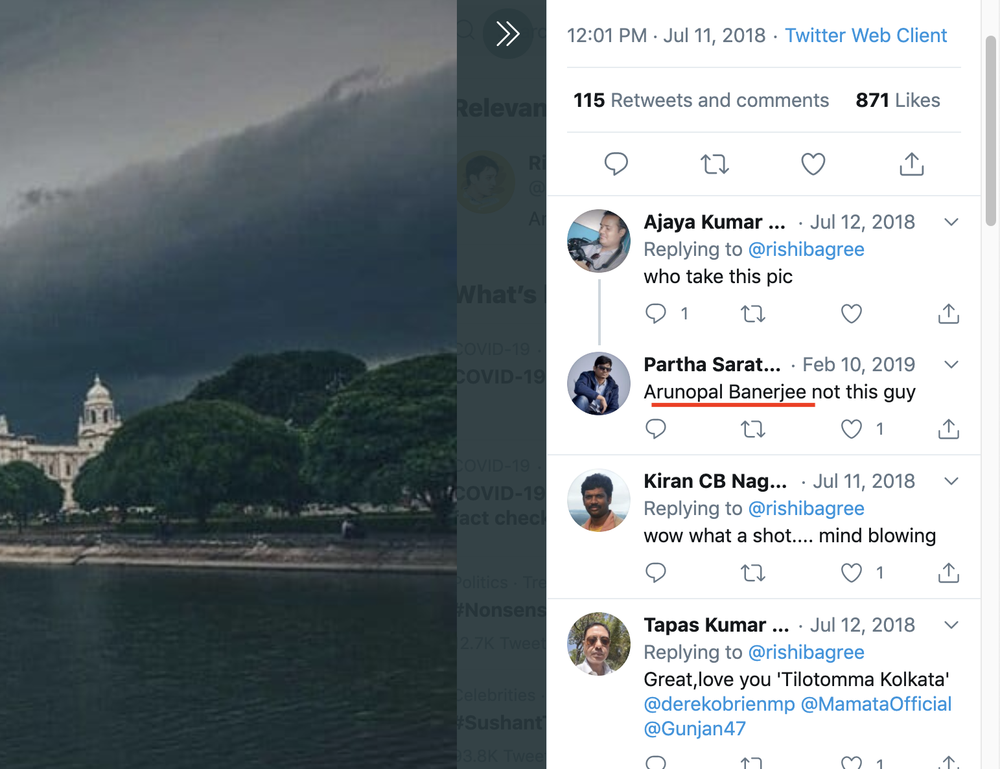
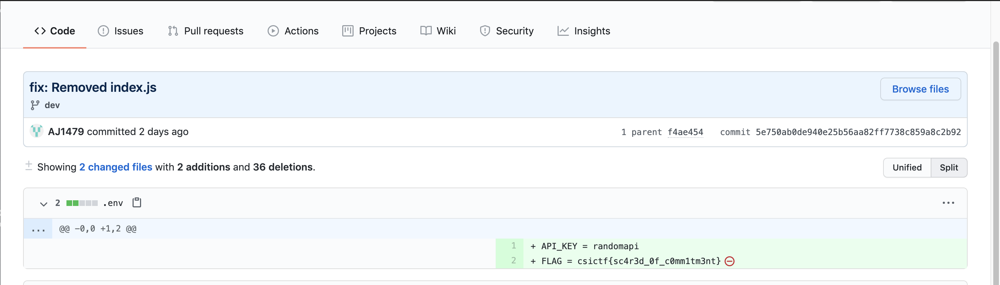

# OSINT


## PIRATES OF MEMORIAL 


CHALLENGE DESCRIPTION :


```
The original photographer of this picture commented the flag on his post. Find the flag.

```

So I basically search the image on Google images. I found a twitter post where their was discussion that who is the original photographer .

So I search the photograoher name on Instagram and got the original [photo](https://www.instagram.com/p/B3oKrLQgpko/), and tha flag was in comment section .



### csictf{pl4g14r1sm_1s_b4d}


## FLYONG PLACES 

CHALLENGE DESCRIPTION :


```
A reporter wanted to know where this flight is headed. Where does he (the reporter) live?

```

So the same process I search the image and found that *Alibaba co-founder Jack Ma has sent the first shipment of surgical masks and coronavirus test kits to the US.* So  serached the twitter of JAck Ma and found this :


### csictf{san_francisco}


## LO SCAMPO 

```
CHALLENGE DESCRIPTION :

'Malcolm X took Broiestevane to a Day of the Dead themed party but she never returned. Her only friends, Mr Bean and the Pink Panther realised that she was missing when she didn't show up for an exam. Broiestevane liked posting pictures, where was the party held? (Don't forget to wrap your answer in csictf{})'
```

Nothing intresting found from google so I search **Broiestevane** username on Instagram and found is [profile](https://www.instagram.com/broiestevane/) his [bio](https://www.instagram.com/p/B3pJE1CgMvI/)  have a link which have the location of the party.


### csictf{liberty_hotel_boston}


## SHAKEN

CHALLENGE DESCRIPTION :

```
I love this watch. It's been with me all over the world, from Istanbul to Shanghai to Macau.I wear it with suits quite a lot. My boss liked it too. I remember wearing it when she died. What is her successor's name?

```

After reading the challenge description how the heck one can find watch wearing by dead person. It was quiety guessy like being an **OO7** fan  I cracked it it was just talking about James Bond  movie (a little research will also lead you to flag).  I just search 
successor of **M** in James Bond movie I got [this](https://www.google.com/search?q=successor+of+Judi+Dench+in+james+bond&rlz=1C5CHFA_enIN849IN853&oq=successor+of+Judi+Dench+in+james+bond&aqs=chrome.0.69i59.946j0j7&sourceid=chrome&ie=UTF-8).


### csictf{gareth_mallory}


## COMMITMENT 

CHALLENGE DESCRIPTION :

```
hoshimaseok is up to no good. Track him down.
```
A username searching OSINT problem you can use any online tool to search **hoshimaseok** on all platform I used sherlock and from the results i searches fb,Ig,reddit ... nothing was foung at last lookin on github I got two repositories and one was named **somethingFishy** based on the challenge name  I looked for the commits on **dev** and flag was in one of the [commit](https://github.com/hoshimaseok/SomethingFishy/commit/5e750ab0de940e25b56aa82ff7738c859a8c2b92). 



### csictf{sc4r3d_0f_c0mm1tm3nt}