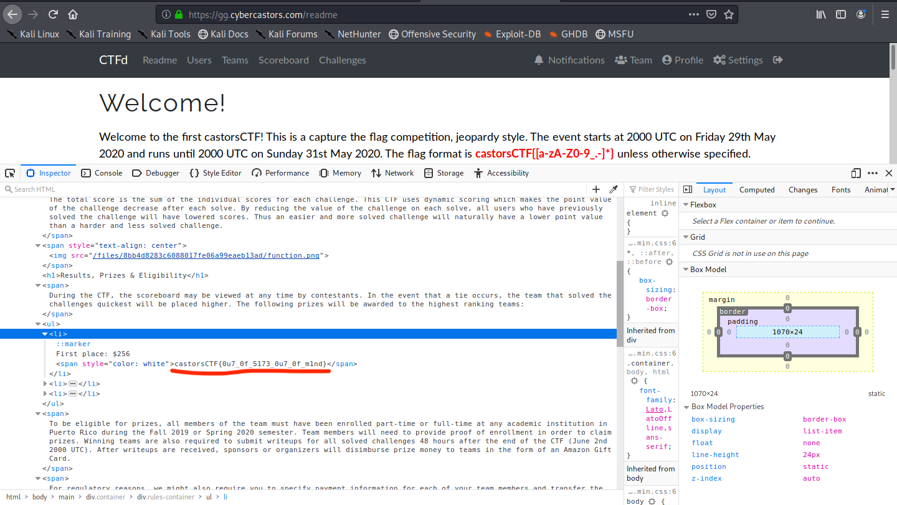
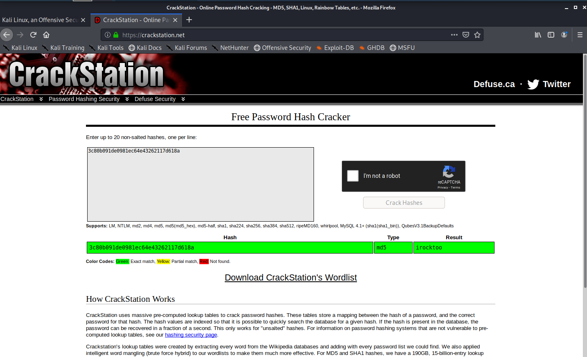
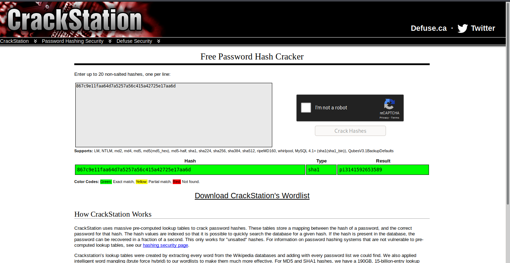
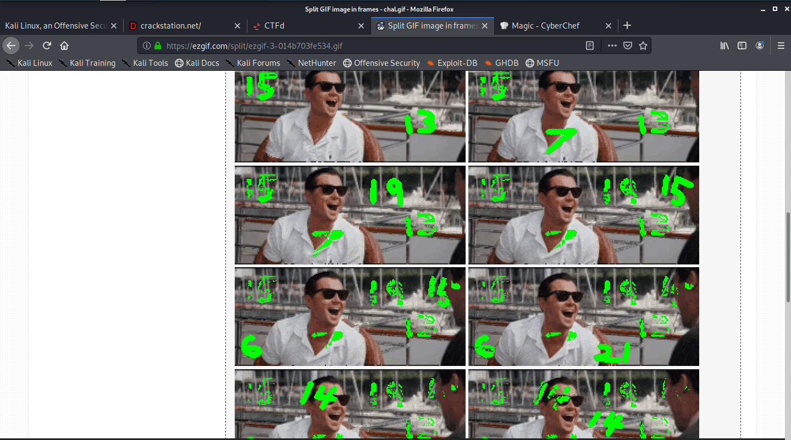
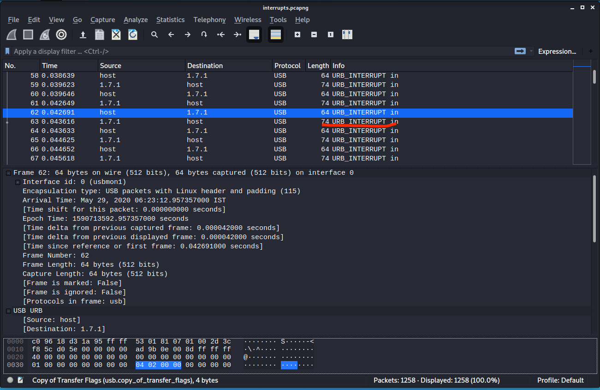
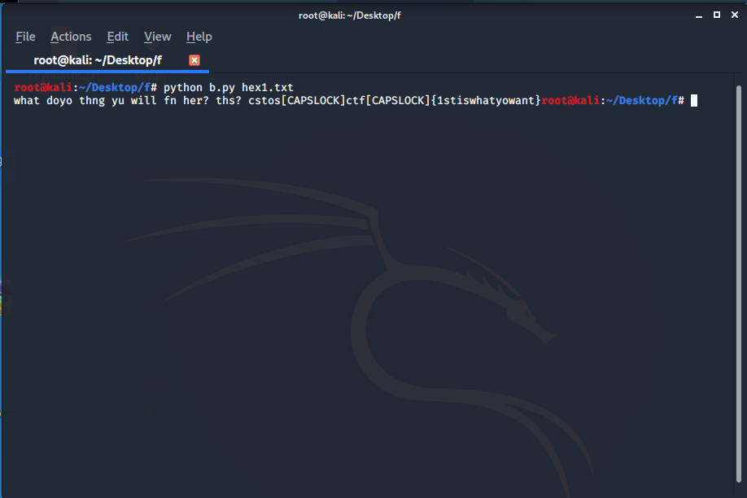
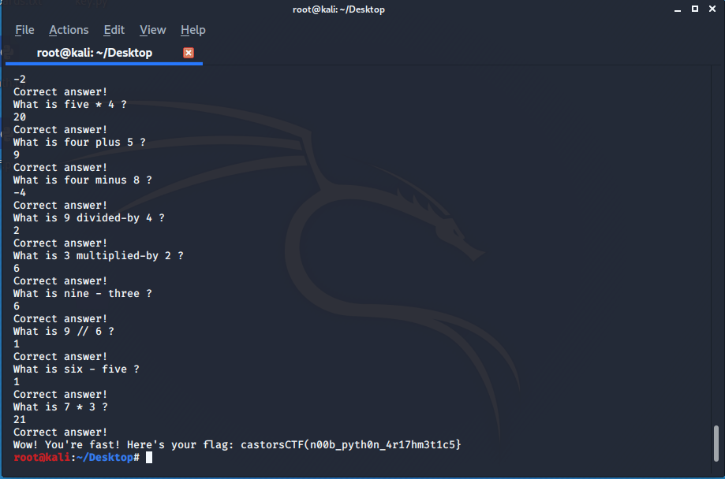

### README

It was an easy peasy as the name suggest something on the readme page but flag was not directly displayed just inspecting the source code will give you the flag.




###  MISC

#### PASSWORD CRACK 1

**c80b091de0981ec64e43262117d618a** this was the hash you can use this [website](https://www.tunnelsup.com/hash-analyzer/) to analyse the hash after analysing I found it a **md5** hash so using brute forcing technique you can crack it, I tried few websites and atlast I found the match in
[crackstation](https://crackstation.net/) which gives us .




#### PASSWORD CRACK 2

**867c9e11faa64d7a5257a56c415a42725e17aa6d** this was the given hash using the same above procedure we found it a **SHA1 (or SHA 128)** hash using [crackstation](https://crackstation.net/)  gives us the flag.



#### GIF


This was the given gif and some randoms numbers  are appearing on it but they are fast in order to get all numbers so the numbers I used  to split the frames which gives all the numbers.



The numbers were

```
15 13 7 19 15 6 21 14 14 25 12 15 12

```

using [cyberchef](https://gchq.github.io/CyberChef/) I found it a **AZ126 CIPHER** after decoding the flag was

```
omgsofunnylol

```

---

### FORENSICS

### LEFTOVERS

A **pcapng** file was given in this challenge using **wireshark** to analyse the captured packets I found it was **usb**  packets Now,to figure out what device was connected. I check the below packets in the wireshark.



I tried to look the GET DESCRIPTOR Response packet, there would be a idVendor and idProduct, from that, we can figure out that whether it’s was Keyboard, mouse or storage device, but when I saw **interrupt in** message after scrolling down I was sure that it was a **keyboard**.

Now, we can use **tshark** to take out, usb.capdata out so I use the below command:

```
tshark -r ./interrupts.pcapng -Y 'usb.capdata && usb.data_len == 8' -T fields -e usb.capdata | sed 's/../:&/g2'

00:00:1a:00:00:00:00:00
00:00:00:00:00:00:00:00
00:00:0b:00:00:00:00:00
00:00:00:00:00:00:00:00

```

I copied the entire output in a txt file and serached for some scripts & code to converet the captured data into actual **keyboard strokes** , since

- Byte 0: Keyboard modifier bits (SHIFT, ALT, CTRL etc)
- Byte 1: reserved
- Byte 2-7: Up to six keyboard usage indexes representing the keys that are currently “pressed”. Order is not important, a key is either pressed (present in the buffer) or not pressed.

and finally I found a beautiful code from [teamrockets](https://github.com/TeamRocketIst/ctf-usb-keyboard-parser/blob/master/usbkeyboard.py) this converts my  captured leftover data into **keyboard strokes**



since we know the first letters of flag after little modification the flag was:

```
castorCTF{1stiswhatyowant}

```


### REVERSE

#### VAULT0

**QUESTION**

- [source](https://github.com/noob-atbash/CTF-writeups/blob/master/cyberCastor-20/resources/arithmetic.py)

```py
def checkpass():
    _input = input("Enter the password: ").encode()
    if _input[0:4].hex() == "63617374":
        if _input[4:9].hex() == "6f72734354":
            if _input[9:14].hex() == "467b723178":
                if _input[14:17].hex() == "54795f":
                    if _input[17:20].hex() == "6d316e":
                        if _input[20:27].hex() == "757433735f6774":
                            if _input[27:35].hex() == "5f73317874795f6d":
                                if _input[35:40].hex() == "316e757433":
                                    if _input[40:].hex() == "737d":
                                        return True


def main():
    global access
    access = checkpass()
    if access:
        print("Yeah...okay. You got it!")
    else:
        print("Lol...try again...")

access = False
main()

```
**FLAG** : castorsCTF{r1xTy_m1nut3s_gt_s1xty_m1nut3s}

It can be easily seen that the flag is the password.just we have to convert the given hex data to ASCII which can be easily done by a python script.

```py
#!/usr/bin/env python3
# -*- coding: utf-8 -*-

def check():
    bytes_object = bytes. fromhex("636173746f72734354467b72317854795f6d316e757433735f67745f73317874795f6d316e757433737d")
    ascii_string = bytes_object.decode("ASCII")
    print(ascii_string)

check()

```

```bash
root@kali:~# ./vault0.py
castorsCTF{r1xTy_m1nut3s_gt_s1xty_m1nut3s}
root@kali:~# python3 chal.py
Enter the password: castorsCTF{r1xTy_m1nut3s_gt_s1xty_m1nut3s}
Yeah...okay. You got it!
```

#### VAULT1

**QUESTION**

```py
import base64

def xor(s1,s2):
    return ''.join(chr(ord(a) ^ ord(b)) for a,b in zip(s1,s2))

def checkpass():
    _input = input("Enter the password: ")
    key = "promortyusvatofacidpromortyusvato"
    encoded = str.encode(xor(key, _input))
    result = base64.b64encode(encoded, altchars=None)
    if result == b'ExMcGQAABzohNQ0TRQwtPidYAS8gXg4kAkcYISwOUQYS':
        return True
    else:
        return False

def main():
    global access
    access = checkpass()
    if access:
        print("Yeah...okay. You got it!")
    else:
        print("Lol...try again...")

access = False
main()

```
**FLAG** : castorsCTF{r1cK_D1e_R1cKp3aT_x0r}

here also the password is the flag the password and the key are undergoing xor operation single characterwise then the encoded is b64 decoded to give the result in bytes format we have to just decode it in **base64** the result will be in bytes format (b'') then we again decoded it in utf-8 to give string .

Now,

```py
a = x ^ y
x = a ^ y
or ,
y = x ^ a
```
so the reverse of the xor function is so much easy

```py
#!/usr/bin/env python3
# -*- coding: utf-8 -*-

import base64


def xor(s1,s2):
    return ''.join(chr(ord(a) ^ ord(b)) for a,b in zip(s1,s2))

key = "promortyusvatofacidpromortyusvato"

encoded =  b'ExMcGQAABzohNQ0TRQwtPidYAS8gXg4kAkcYISwOUQYS'

result = base64.b64decode( b'ExMcGQAABzohNQ0TRQwtPidYAS8gXg4kAkcYISwOUQYS')


result = result.decode("utf-8")

flag = str.encode(xor(key,result))

print(flag.decode('utf-8'))

```

```
root@kali:~# ./vault1.py
castorsCTF{r1cK_D1e_R1cKp3aT_x0r}
root@kali:~# python3 chal.py
Enter the password: castorsCTF{r1cK_D1e_R1cKp3aT_x0r}
Yeah...okay. You got it!
```

### CODING

#### ARITHMETICS

**QUESTION**
```
server:  nc chals20.cybercastors.com 14429

------------------Welcome to Beginner Arithmetics!------------------
To get the flag you'll have to solve a series of arithmetic challenges.
The problems may be addition, substraction, multiplication or integer division.
Numbers can range from 1 to 9. Easy right?
You'll have very little time to answer so do your best!
Hit <enter> when ready.

What is 9 // 3 ?
3
Correct answer!
What is 1 - 6 ?
5
Wrong answer! The correct answer was -5
```


>It will ask 100 basic arithmetic questions but it has to answered very fast ..Its impossible for a human to do so we need to automate the process like a bot So I wrote a python script to solve for us.

**FLAG** : castorsCTF(n00b_pyth0n_4r17hm3t1c5}

```py
#!/usr/bin/env python3
# -*- coding: utf-8 -*-

import pwn
from word2number import w2n
import socket


def words_to_symbol(str):
    if str == "plus":
        return("+")

    elif str == 'minus':
        return("-")

    elif str == "divided-by":
        return("//")

    elif str == "multiplied-by":
        return("*")
    else:
        return(str)


def words_to_number(str):
    list = str.split()
    list[0] = w2n.word_to_num(list[0])
    list[2] = w2n.word_to_num(list[2])
    str = words_to_symbol(list[1])
    return ("{} {} {}".format(list[0],str,list[2]))


r = pwn.remote('chals20.cybercastors.com', 14429)

r.recvline_contains('Hit <enter> when ready.')
r.sendline()
while True:
    try :
        s = r.recvline(False)
        s = s.decode('utf-8')
        print (s)
        if s.endswith('?'):

            # filtering the actual question

            s = words_to_number(s[8:-2])
            answer = str(eval(s))
            print (answer)
            r.sendline(answer)
    except:
        # after the EOF is received it will receive data upto '}'
        print(r.recvuntil('}').decode('utf-8'))
        break

```

