# HSCTF-20

## WEB EXPLOITATION

### INSPECTOR GADGET
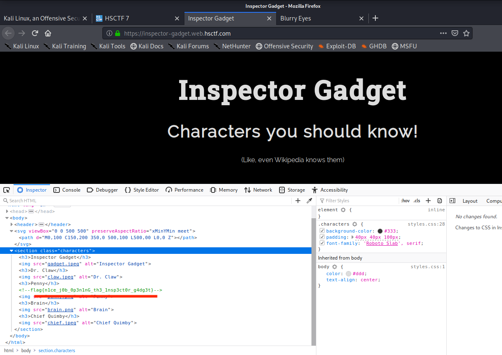

An easy peasy ones inspecting the source code gives the flag **flag{n1ce_j0b_0p3n1nG_th3_1nsp3ct0r_g4dg3t}**


#### BLURRY EYES

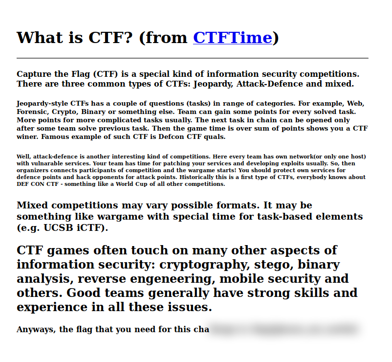

A <code> span </code> tag was blurred it was having a **class="poefKuKjNPojzLDf"** so searching for this spesific class in *styles.css* gives

```
.poefKuKjNPojzLDf:after {
	content: "f" "l" "a" "g" "{" "g" "l" "a" "s" "s" "e" "s" "_" "a" "r" "e" "_" "u" "s" "e" "f" "u" "l" "}" ;
}

```
**flag{glasses_are_useful}**

### SAFE LOGIN
The challenge was quite easy we have to login and credentials were available in the source code in a javascript function.
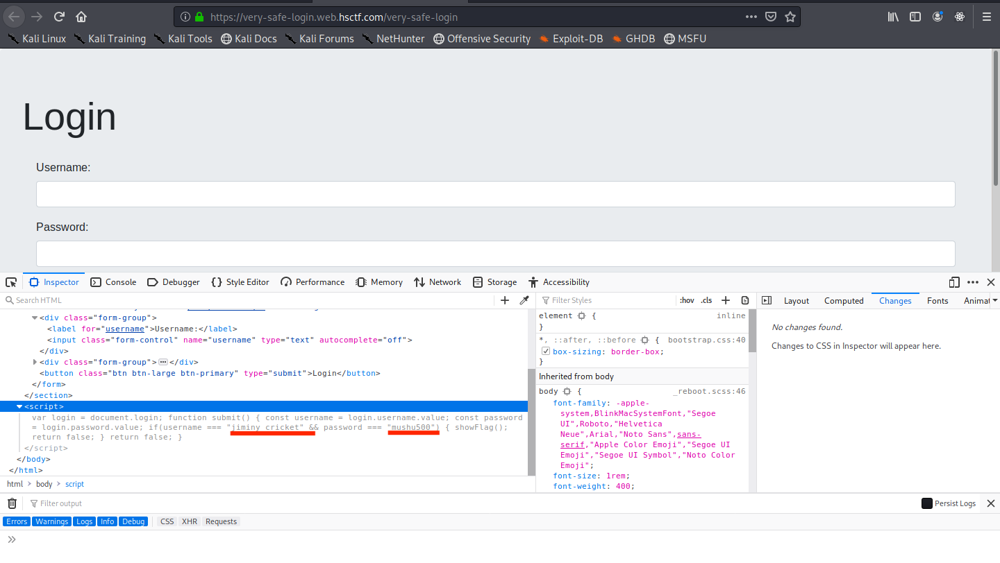

---

## CRYPTOGRAPHY

### XORead

Given Ques:

```
I was given the following equations. Can you help me decode the flag?
Key 1 = 5dcec311ab1a88ff66b69ef46d4aba1aee814fe00a4342055c146533
Key 1 ^ Key 3 = 9a13ea39f27a12000e083a860f1bd26e4a126e68965cc48bee3fa11b
Key 2 ^ Key 3 ^ Key 5 = 557ce6335808f3b812ce31c7230ddea9fb32bbaeaf8f0d4a540b4f05
Key 1 ^ Key 4 ^ Key 5 = 7b33428eb14e4b54f2f4a3acaeab1c2733e4ab6bebc68436177128eb
Key 3 ^ Key 4 = 996e59a867c171397fc8342b5f9a61d90bda51403ff6326303cb865a
Flag ^ Key 1 ^ Key 2 ^ Key 3 ^ Key 4 ^ Key 5 = 306d34c5b6dda0f53c7a0f5a2ce4596cfea5ecb676169dd7d5931139


```

It was also a simple XOR decoding 5 unknowns were given so simple mathematics 5 unknowns 5 eqs to solve.


```
Key1 = 0x5dcec311ab1a88ff66b69ef46d4aba1aee814fe00a4342055c146533

Key3 = Key1 ^ 0x9a13ea39f27a12000e083a860f1bd26e4a126e68965cc48bee3fa11b

Key4 = Key3 ^ 0x996e59a867c171397fc8342b5f9a61d90bda51403ff6326303cb865a

Key5 = Key1 ^ ( Key4 ^ 0x7b33428eb14e4b54f2f4a3acaeab1c2733e4ab6bebc68436177128eb )

Key2 = Key3 ^ ( Key5 ^ 0x557ce6335808f3b812ce31c7230ddea9fb32bbaeaf8f0d4a540b4f05 )

Flag  = Key1 ^ ( Key2 ^ ( Key3 ^ ( Key4 ^ ( Key5 ^ 0x306d34c5b6dda0f53c7a0f5a2ce4596cfea5ecb676169dd7d5931139 ))))


````
I wrote a python script but didn't work for some silly mistakes so I use this [website](https://onlinehextools.com/xor-hex-numbers) to calcuate **xor** .

```
Key3 = c7dd292859609aff68bea47262516874a49321889c1f868eb22bc428
Key4 = 5eb370803ea1ebc6177690593dcb09adaf4970c8a3e9b4edb1e04272
Key5 = 784ef11f24f5286d8334ad01fe2aaf90722c9443426c72defa850faa
Key2 = eaef3e04259d412af94438b4bf76194d2d8d0e6571fcf91a1ca58487
Flag =666c61677b6e30745f7430305f683472445f6830703366756c6c797d

```
After converting the hex to ascii we get the flag

**flag{n0t_t00_h4rD_h0p3fully}**


### UNEXPECTED (RSA)

One of the fine RSA question three different values were given for n e and c

Some from the given relation in question the main challenge was to get p,q and r and simple mathematics we got the relation.

```

P²=(N1*N3)/N2
Q²=(N1*N2)/N3
R²=(N3*N2)/N1

```

So I wrote a python script to do the heavy calcuations .

```python
#!/usr/bin/env python3
from sympy import root
from Crypto.Util.number import inverse, long_to_bytes


e = 65537
N1=3895738302299059518129198422310169628530536557191890566210939781698372336257482186582163630847612416277492034959243510457939210010336159061758606919109259916143600981918456942199762738624796190838889500238780675229383463267807384154074134251073572174392024892486431125499446924573006208711810847272390619510395812856188247531815920797526102562723333957594242603466996229335924848954210939152042149332307810693239925149256224795031982752752336401872520016106145667479144091130160998875256860809091721275069193773739370057334041922519998813268278574260846083883264261920589114740823464192397850923545998904365370408113

N2=3036683903819675505741091164945461947189004916494633766372176282409409694958701211748277050499101511956962003835932755555293255586827283990400451317444723234406968971873530093281591689832798646915816609347861047534121792409030834659241904646743453387504496246791081682741245482378149293399372654558929658582070853972454887854658545741800574343930155288517185535533201220281739954820271979667081052363406511938025061398551356675540358212449132781674832812796443378476387659729623581274433769056775163718782871879747276327458473970177451591251859530403032170215968101310739004163533767679394201611410832974546802038041

N3=4793455677299549137382284585015750073239112414361680529255951318217960300841340399094743130287927996565298160174555422185410320841942637374406558835150138631140265626020072464652973386772727192540062051929655235552439145036105501434801984612127808829810146844869487529177642676245549299371487478280457673839725488195812744535928488844735950540356920273038857127652414836352483913807655170699520816765863272825856765769043174406026964068017257738085400965661973681558654658747878342173984592411085018242201038877382766239487564503728442821348064764166024851080258629751476765613997512620274759264076272801682962144457

c1=396708474546125804352894757436683688457291028695044217325853929491171136935487190613513217479209066321213697066977005912522338337419604329864854419961723570625025089500459612736934675744115710978556346050350466970024450696226499749911198313775828281699871502987873199226066403667788132060336882800770615332190939846610876881382430101512212915247532319827304296610854802037475047119525110795533529161852951539770153761419387662527094415537933400873451490021233979268224054475360645920086811082803271848565851436058022797610887635287190533293980480191482625531855511415716253479184799509403767653927424232672209598509

c2=355006513750551550798931713354683491263062473879176656452255051848683497534660576981575518851351256702360823676609578259232763677292692743319345273559085724516350773319337226043634439282120083618718026203533033564167432280901197175559735572797382863132012675404876908914335941746393221402727788260354881773319480220225939283398326940847106630716629330817737251316474369640273632208347751866683363389016722969822345738247486942531821199790024647950924227337611907877819668593060172268197128413003269501597578146759488894526193598933152416894414296396043283131502951693668167550687432080480619240585408701379144341703

c3=924835278307680480966328618545268895077532556525413716080960421925985654497130329688156219485942736928562517552888163928270855659413958949301590302010862666331053838345196518237383846281768395909801043955047640003147798786793258813501366000503338638933238548605016169865688228297750780710248359326295693845663887055907900967535999885217905972006140096240831305484619796964713673839223632057905454213937054336962510051529266336629730913756688411854427999570223208667606703681762027957427028839409594591627448224813082072169775916331655060221445546199171668136050686471357710989346885039441000083764142021784018773006


P = int(root((N1 * N3) // N2, 2))
Q = int(root((N1 * N2) // N3, 2))
R = int(root((N3 * N2) // N1, 2))


phi1 = (P - 1) * (Q - 1)
d1 = inverse(e, phi1)

phi2 = (Q - 1) * (R - 1)
d2 = inverse(e, phi2)

phi3 = (P - 1) * (R - 1)
d3 = inverse(e, phi3)

m1 = pow(c1, d1, N1)
flag1 = long_to_bytes(m1).decode()
print(flag1)

m2 = pow(c2, d2, N2)
flag2 = long_to_bytes(m2).decode()
print(flag2)

m3 = pow(c3, d3, N3)
flag3 = long_to_bytes(m3).decode()
print(flag3)

```
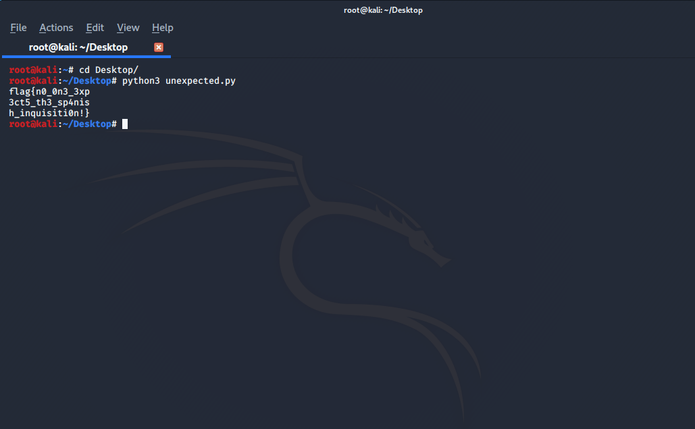

### ChonkE

####[RSA(boneh & dufree attac) & Schmidt-Samoa cryptosystem]

The question was:

```
Allen and Jason rely on two different cryptosystems to keep their information secure.

Allen uses the RSA cryptosystem, given by the following public key:
e = 91043118409828550796773745518585981151180206101005135117565865602978722878478494447048783557571813980525643725323377488249838860897784683927029906188947001149632101513367258267329961684034661252866484981926055087386190015432964608927947646476193251820354738640453947833718397360834701566765504916472450194494897616371452996381159817427887623703639133290358520498419049175941584678802701606995099241245926884172985004839801270005583030514286561971825047719421487004569752638468907609110285739083279629747310953086535889932550905065172805818862336335628248528993024112446002398466115161473573451161053837400091893285717
n = 156749047558583013960513267351769479915110440411448078412590565797031533622509813352093119636835511977253033854388466854142753776146092587825440445182008237325262012698034419137157047927918635897378973846177552961727126115560551970797370239385129543828686170774323306933202481728884019420422360360849592983818405154473369790181636472137741865440233383956571081122982223602667853668754338360008279002325576495573847568301584365514417593244726435632222027817410359417329310347952169273512510934251453361933794586716533950489973436393834189505450956622286216819440777162804798432330933357058175885674184582816364542591313

Jason uses the Schmidt-Samoa cryptosystem. Although a public key has not been recovered, we know that Allen and Jason share the same primes (p,q).

A ciphertext was found on Jason’s computer that reads: 16267540901004879123859424672087486188548628828063789528428674467464407443871599865993337555869530486241139138650641838377419734897801380883629894166353225288006148210453677023750688175192317241440457768788267270422857060534261674538755743244831152470995124962736526978165448560149498403762447372653982922113772190234143253450918953235222315161964539311032659628670417496174123483045439359846360048774164337257829398345686635091862306204455687347443958931441225500856408331795261329035072585605404416473987280037959184981453888701567175803979981461050532113072292714696752692872526424122826696681194705563391161137426703690900733706866842363055967856443765215723398555522126909749236759332964873221973970368877565410624895160438695006432021529071866881905134494489266801004903504121740435965696128048690741210812963902631391765192187570107372453917327060678806282122942318369245760773848604249664378721970318257356486696764545

What are the contents of this message?

```

Ultimately the goal was to found p and q but how ? after some research after I found it was **boneh & dufree attack**.

This attack allows us to break RSA and the private exponent d. Here's why RSA works (where e is the public exponent, phi is euler's totient function, N is the public modulus):

```
ed = 1 mod phi(N)
=> ed = k phi(N) + 1 over Z
=> k phi(N) + 1 = 0 mod e
=> k (N + 1 - p - q) + 1 = 0 mod e
=> 2k [(N + 1)/2 + (-p -q)/2] + 1 = 0 mod e

```
The last equation gives us a bivariate polynomial <code> f(x,y) = 1 + x * (A + y).</code> Finding the roots of this polynomial will allow us to easily compute the private exponent d.

The attack works if the private exponent d is too small compared to the modulus: </code>  d < N^0.292. </code>

I found this entire information from a cool guy [github](https://github.com/mimoo/RSA-and-LLL-attacks/) he has writen an implementation of the attack in Sage that we can use :D. So plugging in our modulus and public exponent values, we can get our private exponent:

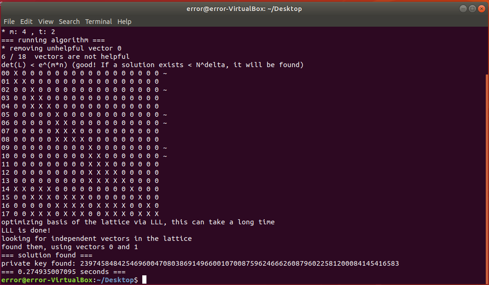

So, having the private exponent, we can recover our original two prime factors. Using this [gist](https://gist.github.com/ddddavidee/b34c2b67757a54ce75cb), we can recover our prime factors.

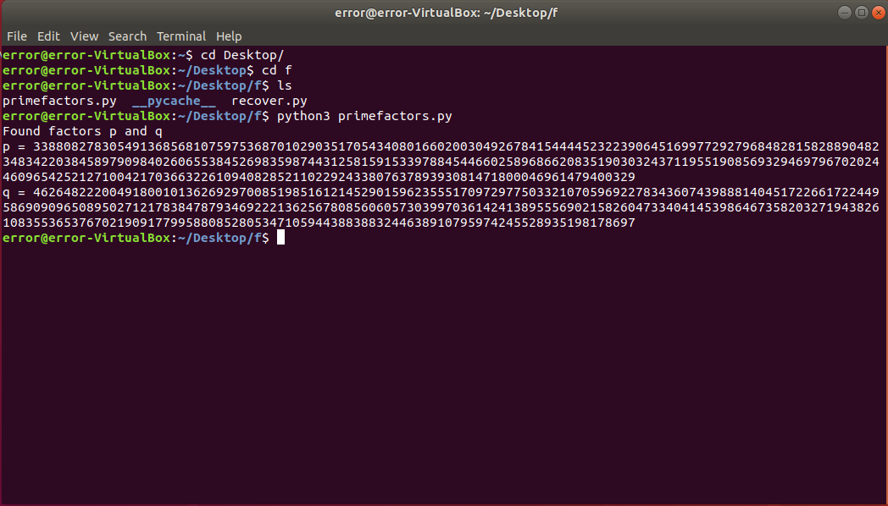

Once you got the primes everything is solve I just wrote a simple script  but remeber we have to decode the cipher text for [Schmidt-Samoa cryptosystem](https://en.wikipedia.org/wiki/Schmidt-Samoa_cryptosystem).


```python
#!/usr/bin/env python3
from sympy import root
from Crypto.Util.number import inverse, long_to_bytes


q=338808278305491368568107597536870102903517054340801660200304926784154444523223906451699772927968482815828890482348342203845897909840260655384526983598744312581591533978845446602589686620835190303243711955190856932946979670202446096542521271004217036632261094082852110229243380763789393081471800046961479400329
p=462648222004918001013626929700851985161214529015962355517097297750332107059692278343607439888140451722661722449586909096508950271217838478793469222136256780856060573039970361424138955569021582604733404145398646735820327194382610835536537670219091779958808528053471059443883883244638910795974245528935198178697

n=156749047558583013960513267351769479915110440411448078412590565797031533622509813352093119636835511977253033854388466854142753776146092587825440445182008237325262012698034419137157047927918635897378973846177552961727126115560551970797370239385129543828686170774323306933202481728884019420422360360849592983818405154473369790181636472137741865440233383956571081122982223602667853668754338360008279002325576495573847568301584365514417593244726435632222027817410359417329310347952169273512510934251453361933794586716533950489973436393834189505450956622286216819440777162804798432330933357058175885674184582816364542591313

e=91043118409828550796773745518585981151180206101005135117565865602978722878478494447048783557571813980525643725323377488249838860897784683927029906188947001149632101513367258267329961684034661252866484981926055087386190015432964608927947646476193251820354738640453947833718397360834701566765504916472450194494897616371452996381159817427887623703639133290358520498419049175941584678802701606995099241245926884172985004839801270005583030514286561971825047719421487004569752638468907609110285739083279629747310953086535889932550905065172805818862336335628248528993024112446002398466115161473573451161053837400091893285717

d=4801820624110300567381264152630360984400101198006662778338105999190025449039653722546363948393959163699344836724430590700225590643966670154013435626235133

c=16267540901004879123859424672087486188548628828063789528428674467464407443871599865993337555869530486241139138650641838377419734897801380883629894166353225288006148210453677023750688175192317241440457768788267270422857060534261674538755743244831152470995124962736526978165448560149498403762447372653982922113772190234143253450918953235222315161964539311032659628670417496174123483045439359846360048774164337257829398345686635091862306204455687347443958931441225500856408331795261329035072585605404416473987280037959184981453888701567175803979981461050532113072292714696752692872526424122826696681194705563391161137426703690900733706866842363055967856443765215723398555522126909749236759332964873221973970368877565410624895160438695006432021529071866881905134494489266801004903504121740435965696128048690741210812963902631391765192187570107372453917327060678806282122942318369245760773848604249664378721970318257356486696764545


N = p*p*q


phi = (p - 1) * (q - 1)
d = inverse(N, phi)


m = pow(c, d, n)
flag1 = long_to_bytes(m).decode()
print(flag1)

```
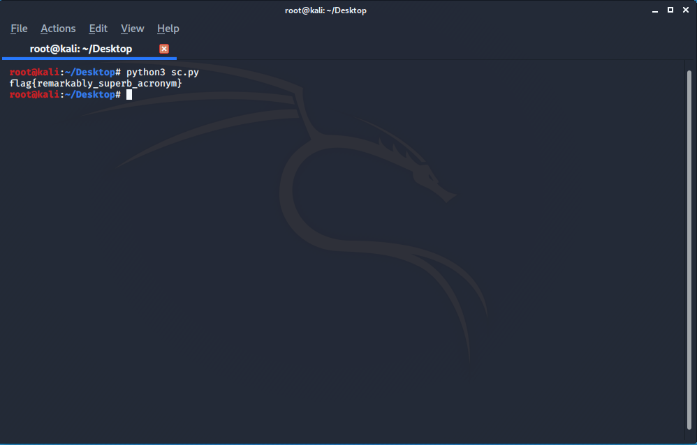

---

### FORENSICS

#### META MOUNTAINS


**flag{h1dd3n_w1th1n_th3_m0unta1ns_l13s_th3_m3tadata}**

Just by using the **exiftool** as question flag was in meta-data I get the flag

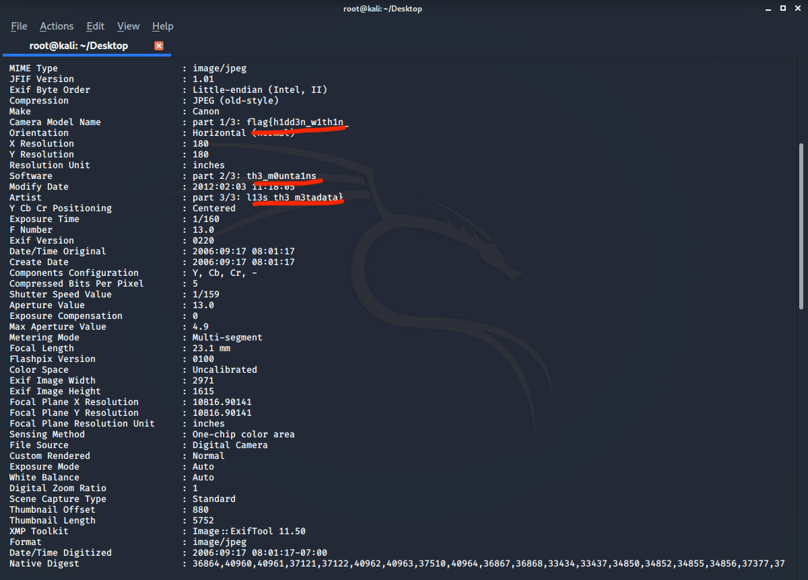


#### MAD LIBS


**flag{v3rB_n0uN_adj3ct1v3}**

I didn't care much about what it really was I used some tool after that I Just upload the image [here](http://stylesuxx.github.io/steganography/) and let this tool do the job and I get the flag


#### COMMENTS

In this question a zip file was given after unzipping we got new zip file at first I thought it was a question of infinite zip files but it was not like that because there was only 8 zip files so after some research I got this

*A comment is optional text information that is embedded in a Zip file. It can be viewed, created, edited, or deleted using the Comment window. Simply type in your text or use any common Windows cut, copy, or paste method. This feature is available for Zip files only (.zip or .zipx).*  later on hints was uploaded for this I used **7zip** to see the comments and flag was

**flag{4n6}**

## MISC

### PRIMES
A text file was given which has only a string written:

```
fe7l1Owa85YA9g8CELs3F{H11s1o258p6hOo77di7Y0V83M1feBdNeP3QuS9G7LVjd8EZU
ei9NOi3p3p9jKcbiUYsy4zA6P88Y7NP73jiLFW4nl8m6xN3LcHttxA2ML73J68g2PtR529
26v1sDi22KE9VhBT8kgc26581q2pP77_bTZ6XPBR3iRT7Jbo9YvsEUiXE6Lv4y790z5wu1
45p6W8Mc6l38tCBPfCq30P7fXD2652g1INKDF3EeUnXm6gLUWOZ9NKhFr19gAaVldd7Fkj
lMuqSaNW3E0BEt4_6y8C35pI6y7IWQoimXQgkIZTR19Z21e33er4YENvt4paILApj4nwPi
DpLFJP8UP0wTZNGN2grACDd6h5MfTWlxpdY8iF79uK38Rn7lFzU15Y6gTA2FSz5163C4eW
TI80c5o9OANDD6WZ0T8M5SC42t6CANB4rDNJH49J9aQQdE6ylWR23c7337ex7vp4KLI9xY
pvBDC0E7VgSZXkE186uDA93lMRNeZ1ynL31hntD9vZQ4V18sd9lWyt433B2jX843A77E8S
l22ds46y640C1q3QthAov3LuB24n9nq3y5f0pJ9E67ECu5g8w29PIuUR2VLhwX1b3Idhyk
J8p8mimNxRPYrGEnMeXoWulV0tTtz_DBz56b3GXi29LWfyw0AkSDIYCG583yCQcEepP1Sj
8LL76R0tKMo38K099uGz17S8N84e1h1Z5576xa0u46e083hHN2m368wN34Eigw5VjG1Gh3
15UqjQr9ff3Ip0m82m8Rm8JT380miS8aC61zS2K4W6o1ymg0nWB977XNc0iu7ee9b142UJ
hprY4Hh35s1TaKc221Q2ip1KX02p6ny96Ay3TIyn9m30qXxc4lKQZxK899BhD98RuX32B0
3dJUi5iL3kQA0B0o4D4Tgq4FTD5JNKJg8Kg5aibRsn9GeOq3E8big7nPKWqUM8SlHd70iH
D8Ciw4XhntUTM9dBPPspkbYL783096NUMRG766Av9A4B3fn1o2CYTO9sG8u2Kqk0VekGq2
0inkHM141pogz69Ng91dnk5wWQRJ8i0Q14MtfFA0hORWW775bM0jJ2R1sb24KhbbD42V1Q
b5s9N36fZ2BpFJR7mR6cKE8Ot7drG92BQ692PLrPbHfbV8QxH4rc9SpTb5RGchC5kB5}c1
CHsMd05v3Fmo3YeT7EaduRD2Q6eOrKbAWn
```
**flag{h1din9_1n_pl41n_519ht}**

>NOTE : The whole text was given on a single line

By giving a closer look flag was written over there in 0th, 3rd, 7th and 13th..... position , if we closely look over the pattern there are:

```
2 numbers between 0 and 3
3 numbers between 3 and 7
5 numbers between 7 and 13
```
2,3,5 it's simply a series of prime number, So as usaui wrote a simple python script to calculate the flag.

```python
#!/usr/bin/env python3
# -*- coding: utf-8 -*-

from sympy import isprime

str="fe7l1Owa85YA9g8CELs3F{H11s1o258p6hOo77di7Y0V83M1feBdNeP3QuS9G7LVjd8EZUei9NOi3p3p9jKcbiUYsy4zA6P88Y7NP73jiLFW4nl8m6xN3LcHttxA2ML73J68g2PtR52926v1sDi22KE9VhBT8kgc26581q2pP77_bTZ6XPBR3iRT7Jbo9YvsEUiXE6Lv4y790z5wu145p6W8Mc6l38tCBPfCq30P7fXD2652g1INKDF3EeUnXm6gLUWOZ9NKhFr19gAaVldd7FkjlMuqSaNW3E0BEt4_6y8C35pI6y7IWQoimXQgkIZTR19Z21e33er4YENvt4paILApj4nwPiDpLFJP8UP0wTZNGN2grACDd6h5MfTWlxpdY8iF79uK38Rn7lFzU15Y6gTA2FSz5163C4eWTI80c5o9OANDD6WZ0T8M5SC42t6CANB4rDNJH49J9aQQdE6ylWR23c7337ex7vp4KLI9xYpvBDC0E7VgSZXkE186uDA93lMRNeZ1ynL31hntD9vZQ4V18sd9lWyt433B2jX843A77E8Sl22ds46y640C1q3QthAov3LuB24n9nq3y5f0pJ9E67ECu5g8w29PIuUR2VLhwX1b3IdhykJ8p8mimNxRPYrGEnMeXoWulV0tTtz_DBz56b3GXi29LWfyw0AkSDIYCG583yCQcEepP1Sj8LL76R0tKMo38K099uGz17S8N84e1h1Z5576xa0u46e083hHN2m368wN34Eigw5VjG1Gh315UqjQr9ff3Ip0m82m8Rm8JT380miS8aC61zS2K4W6o1ymg0nWB977XNc0iu7ee9b142UJhprY4Hh35s1TaKc221Q2ip1KX02p6ny96Ay3TIyn9m30qXxc4lKQZxK899BhD98RuX32B03dJUi5iL3kQA0B0o4D4Tgq4FTD5JNKJg8Kg5aibRsn9GeOq3E8big7nPKWqUM8SlHd70iHD8Ciw4XhntUTM9dBPPspkbYL783096NUMRG766Av9A4B3fn1o2CYTO9sG8u2Kqk0VekGq20inkHM141pogz69Ng91dnk5wWQRJ8i0Q14MtfFA0hORWW775bM0jJ2R1sb24KhbbD42V1Qb5s9N36fZ2BpFJR7mR6cKE8Ot7drG92BQ692PLrPbHfbV8QxH4rc9SpTb5RGchC5kB5}c1CHsMd05v3Fmo3YeT7EaduRD2Q6eOrKbAWn"

flag = 'f'
primes = []
for i in range(1,300):
    if isprime(i):
        primes.append(i)
i = 1
for k in range(26):
   i += primes[k]
   flag += str[i]
   i += 1


print(flag)

```
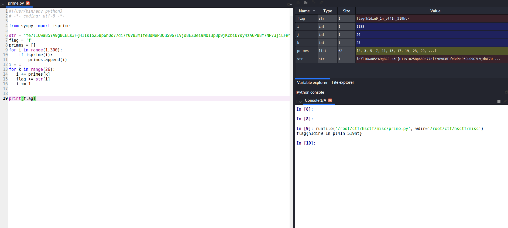


## REVERSE ENGINEERING

### AP Lab: Computer Science Principles**

A .java file was given

```java
import java.util.Scanner;
public class ComputerSciencePrinciples
{
    public static void main(String[] args) {
        Scanner sc = new Scanner(System.in);
        String inp = sc.nextLine();
        if (inp.length()!=18) {
            System.out.println("Your input is incorrect.");
            System.exit(0);
        }
        inp=shift2(shift(inp));
        if (inp.equals("inagzgkpm)Wl&Tg&io")) {                                                  
            System.out.println("Correct. Your input is the flag.");
        }
        else {
            System.out.println("Your input is incorrect.");
        }
        System.out.println(inp);
    }
    public static String shift(String input) {
        String ret = "";
        for (int i = 0; i<input.length(); i++) {
            ret+=(char)(input.charAt(i)-i);
        }
        return ret;
    }
    public static String shift2(String input) {
        String ret = "";
        for (int i = 0; i<input.length(); i++) {
            ret+=(char)(input.charAt(i)+Integer.toString((int)input.charAt(i)).length());
        }
        return ret;
    }
}

```
ANTo get the flag we just have to reverse the code..

**flag{intr0_t0_r3v}**

```java
import java.util.Scanner;
public class ComputerSciencePrinciples
{
    public static void main(String[] args) {
        Scanner sc = new Scanner(System.in);
        String inp ;
        inp="inagzgkpm)Wl&Tg&io";
        inp=shift(shift2(inp));
        System.out.println(inp);
    }
    public static String shift(String input) {
        String ret = "";
        for (int i = 0; i<input.length(); i++) {
            ret+=(char)(input.charAt(i)+i);
        }
        return ret;
    }
    public static String shift2(String input) {
        String ret = "";
        for (int i = 0; i<input.length(); i++) {
            ret+=(char)(input.charAt(i)-Integer.toString((int)input.charAt(i)).length());
        }
        return ret;
    }
}
```
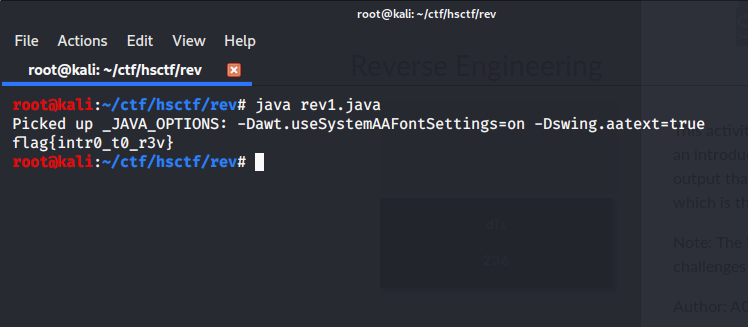

### AP Lab: English Language

Again .java file was given .

```java
import java.util.Scanner;
public class EnglishLanguage
{
    public static void main(String[] args) {
        Scanner sc = new Scanner(System.in);
        String inp = sc.nextLine();
        if (inp.length()!=23) {
            System.out.println("Your input is incorrect.");
            System.exit(0);
        }
        for (int i = 0; i<3; i++) {
            inp=transpose(inp);
            inp=xor(inp);
        }
        if (inp.equals("1dd3|y_3tttb5g`q]^dhn3j")) {
            System.out.println("Correct. Your input is the flag.");
        }
        else {
            System.out.println("Your input is incorrect.");
        }
    }
    public static String transpose(String input) {
        int[] transpose = {11,18,15,19,8,17,5,2,12,6,21,0,22,7,13,14,4,16,20,1,3,10,9};
        String ret = "";
        for (int i: transpose) {
            ret+=input.charAt(i);
        }
        return ret;
    }
    public static String xor(String input) {
        int[] xor = {4,1,3,1,2,1,3,0,1,4,3,1,2,0,1,4,1,2,3,2,1,0,3};
        String ret = "";
        for (int i = 0; i<input.length(); i++) {
            ret+=(char)(input.charAt(i)^xor[i]) ;
        }
        return ret;
    }
}
```
We just have to reverse the code to get the flag

**flag{n0t_t00_b4d_r1ght}**

```java
import java.util.Scanner;
public class EnglishLanguage
{
    public static void main(String[] args) {
        Scanner sc = new Scanner(System.in);
        String inp="1dd3|y_3tttb5g`q]^dhn3j";
        if (inp.length()!=23) {
            System.out.println("Your input is incorrect.");
            System.exit(0);
        }
        for (int i = 0; i<3; i++) {
            inp=xor(inp);
            inp=transpose(inp);
        }
        System.out.println(inp);
    }
    public static String transpose(String input) {
        int[] transpose = {11,18,15,19,8,17,5,2,12,6,21,0,22,7,13,14,4,16,20,1,3,10,9};
        char str[]=new char[23];
        for (int i=0;i<23;i++)
        {
            str[transpose[i]]=input.charAt(i);
        }
        return String.valueOf(str);
    }
    public static String xor(String input) {
        int[] xor = {4,1,3,1,2,1,3,0,1,4,3,1,2,0,1,4,1,2,3,2,1,0,3};
        String ret = "";
        for (int i = 0; i<input.length(); i++) {
            ret+=(char)(input.charAt(i)^xor[i]) ;
        }
        return ret;
    }
}
```

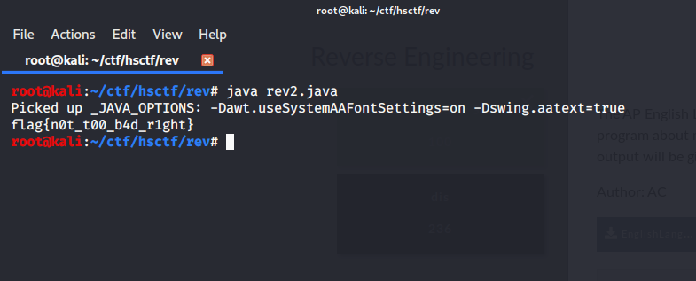

