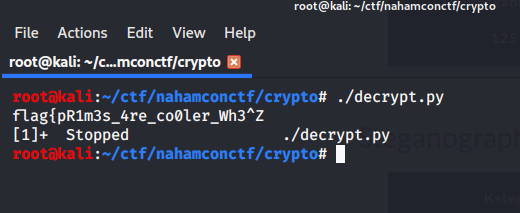
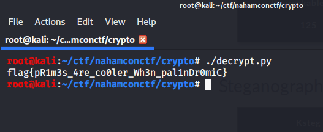
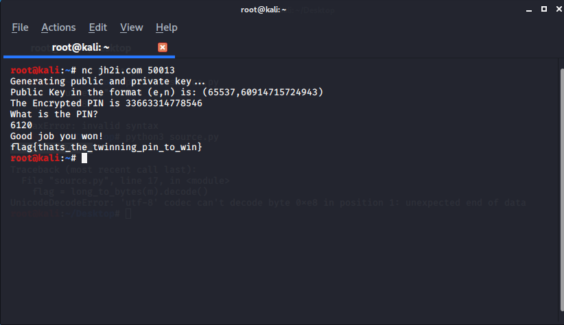
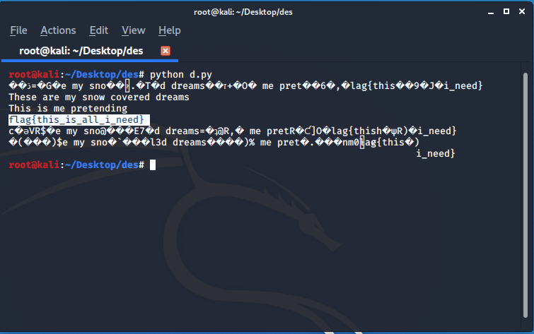
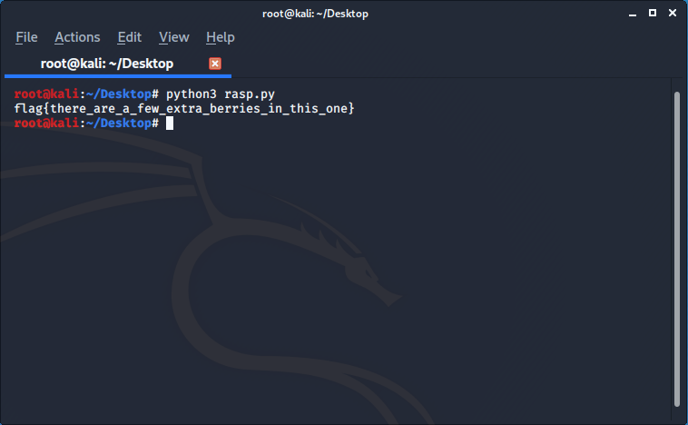

# CRYPTO

## HOMECOOKED

A python file was given

```py
import base64
num = 0
count = 0
cipher_b64 = b"MTAwLDExMSwxMDAsOTYsMTEyLDIxLDIwOSwxNjYsMjE2LDE0MCwzMzAsMzE4LDMyMSw3MDIyMSw3MDQxNCw3MDU0NCw3MTQxNCw3MTgxMCw3MjIxMSw3MjgyNyw3MzAwMCw3MzMxOSw3MzcyMiw3NDA4OCw3NDY0Myw3NTU0MiwxMDAyOTAzLDEwMDgwOTQsMTAyMjA4OSwxMDI4MTA0LDEwMzUzMzcsMTA0MzQ0OCwxMDU1NTg3LDEwNjI1NDEsMTA2NTcxNSwxMDc0NzQ5LDEwODI4NDQsMTA4NTY5NiwxMDkyOTY2LDEwOTQwMDA="

def a(num):
    if (num > 1):
        for i in range(2,num):
            if (num % i) == 0:
                return False
                break
        return True
    else:
        return False

def b(num):
    my_str = str(num)
    rev_str = reversed(my_str)
    if list(my_str) == list(rev_str):
       return True
    else:
       return False


cipher = base64.b64decode(cipher_b64).decode().split(",")
while(count < len(cipher)):
    if (a(num)):
        if (b(num)):
            print(chr(int(cipher[count]) ^ num), end='', flush=True)
            count += 1
            if (count == 13):
                num = 50000
            if (count == 26):
                num = 500000
    else:
        pass
    num+=1

print()
```
Which gives an incomplete output of the flag.



>: FLAG : flag{pR1m3s_4re_co0ler_Wh3n_pal1nDr0miC}

We have the find out that why this script is giving an
output.

after seeing the code i understood that cipher is a list
with very large numbers as a series.

a() function is determining that num is prime or not
b() function is determining that num is pallindrome or not .

so print function is only coming into action if the number
if num is pallindromic prime ..

Now, the printing of the flag stops after hiting count = 26
and then num is set to 500k .
It is not possible for our system to determine that much
big prime numbers .
so i just replace the a(num) function with isprime() function
and got the flag.
```
#!/usr/bin/env python3
# -*- coding : utf-8 -*-
import base64
from sympy import isprime
num = 0
count = 0
cipher_b64 = b"MTAwLDExMSwxMDAsOTYsMTEyLDIxLDIwOSwxNjYsMjE2LDE0MCwzMzAsMzE4LDMyMSw3MDIyMSw3MDQxNCw3MDU0NCw3MTQxNCw3MTgxMCw3MjIxMSw3MjgyNyw3MzAwMCw3MzMxOSw3MzcyMiw3NDA4OCw3NDY0Myw3NTU0MiwxMDAyOTAzLDEwMDgwOTQsMTAyMjA4OSwxMDI4MTA0LDEwMzUzMzcsMTA0MzQ0OCwxMDU1NTg3LDEwNjI1NDEsMTA2NTcxNSwxMDc0NzQ5LDEwODI4NDQsMTA4NTY5NiwxMDkyOTY2LDEwOTQwMDA="

def a(num):
    if (num > 1):
        for i in range(2,num):
            if (num % i) == 0:
                return False
                break
        return True
    else:
        return False

def b(num):
    my_str = str(num)
    rev_str = reversed(my_str)
    if list(my_str) == list(rev_str):
       return True
    else:
       return False


cipher = base64.b64decode(cipher_b64).decode().split(",")
while(count < len(cipher)):
    if (isprime(num)):
        if (b(num)):
            print(chr(int(cipher[count]) ^ num), end='', flush=True)
            count += 1
            if (count == 13):
                num = 50000
            if (count == 26):
                num = 500000
    else:
        pass
    num+=1

print()

```


## TWINNING

After connection to this **nc jh2i.com 50013** we were given the  randomly generated public key in the format of (e,n) and and encrypted pin the main goal was to found **PIN** It's [RSA](https://en.wikipedia.org/wiki/RSA_(cryptosystem)) problem so the pin is <code> d </code> , the modular multiplicative inverse.

Since n was given we can calculate the p and q and for this I used a very cool site [Alpetron](https://www.alpertron.com.ar/ECM.HTM) for integer factorization, which uses [ECM](https://en.wikipedia.org/wiki/Lenstra_elliptic-curve_factorization) method for factoring integers.

Once you get the factor the target is to find to compute <code> d </code> , the modular multiplicative inverse of e (mod λ(n)) yielding.

```py
#!/usr/bin/env python3
from sympy import root
from Crypto.Util.number import inverse, long_to_bytes

p= 7804787
q= 7804789
e = 65537
c=33663314778546
n=p*q


phi = (p - 1) * (q - 1)
d = inverse(e, phi)
print(d)

```


## Ooo-la-la

A simple RSA problem you with the given values

```
N = 3349683240683303752040100187123245076775802838668125325785318315004398778586538866210198083573169673444543518654385038484177110828274648967185831623610409867689938609495858551308025785883804091
e = 65537
c = 87760575554266991015431110922576261532159376718765701749513766666239189012106797683148334771446801021047078003121816710825033894805743112580942399985961509685534309879621205633997976721084983

```

I used [RsaCtfTool](https://github.com/Ganapati/RsaCtfTool) to solve this or either you can use some techniques get p and q and write a python script to solve the problem (which I used above and will be using in further problem )


## DECEMBER

In this problem a <code> source.py </code> and cipher text were given

```py
#!/usr/bin/env python

from Crypto.Cipher import DES

with open('flag.txt', 'rb') as handle:
	flag = handle.read()

padding_size = len(flag) + (8 - ( len(flag) % 8 ))
flag = flag.ljust(padding_size, b'\x00')

with open('key', 'rb') as handle:
	key = handle.read().strip()

iv = "13371337"
des = DES.new(key, DES.MODE_OFB, iv)
ct = des.encrypt(flag)

with open('ciphertext','wb') as handle:
	handle.write(ct)


```
A quick glance at the code (and the challenge title) tells us that we're dealing with Data Encryption Standard (DES) utilizing Output Feedback (OFB) mode. We can also see in the code that we already have the Initialization Vector (IV) used for encryption IV =  "13371337". A quick refresher on OFB shows that the decryption process envolves the IV and key being encrypted and then XORed with the ciphertext to return our plaintext.

My first thought was just to try and bruteforce the key but it didn't work so I do some more research  and looked a little deeper into DES and OFB together. I quickly came across an [article](https://crypto.stackexchange.com/questions/7938/may-the-problem-with-des-using-ofb-mode-be-generalized-for-all-feistel-ciphers) that proved to be very helpful.

From the article it was clear that it was weak key DES problem. With a little more help from Google I found an [article]((https://en.wikipedia.org/wiki/Weak_key)) that directly called out weak keys for DES. In it we find the following 4 weak keys:

```
0x0000000000000000
0xFFFFFFFFFFFFFFFF
0xE1E1E1E1F0F0F0F0
0x1E1E1E1E0F0F0F0F

```

So lets a write a python script to solve our problem
```py
from Crypto.Cipher import DES

f = open('ciphertext', 'rb')
ciphertext = f.read()
f.close()
IV = "13371337"
KEY=b'\x00\x00\x00\x00\x00\x00\x00\x00'
a = DES.new(KEY, DES.MODE_OFB, IV)
plaintext = a.decrypt(ciphertext)
print plaintext

KEY=b'\x1E\x1E\x1E\x1E\x0F\x0F\x0F\x0F'
a = DES.new(KEY, DES.MODE_OFB, IV)
plaintext = a.decrypt(ciphertext)
print plaintext

KEY="\xE1\xE1\xE1\xE1\xF0\xF0\xF0\xF0"
a = DES.new(KEY, DES.MODE_OFB, IV)
plaintext = a.decrypt(ciphertext)
print plaintext

KEY="\xFF\xFF\xFF\xFF\xFF\xFF\xFF\xFF"
a = DES.new(KEY, DES.MODE_OFB, IV)
plaintext = a.decrypt(ciphertext)
print plaint

```



## RASPBERRY

We are provided with prompt.txt with these values :

```
n = 7735208939848985079680614633581782274371148157293352904905313315409418467322726702848189532721490121708517697848255948254656192793679424796954743649810878292688507385952920229483776389922650388739975072587660866986603080986980359219525111589659191172937047869008331982383695605801970189336227832715706317
e = 65537
c = 5300731709583714451062905238531972160518525080858095184581839366680022995297863013911612079520115435945472004626222058696229239285358638047675780769773922795279074074633888720787195549544835291528116093909456225670152733191556650639553906195856979794273349598903501654956482056938935258794217285615471681

```

A RSA problem our first step was to find p and q [Alpetron](https://www.alpertron.com.ar/ECM.HTM) for integer factorization, which uses [ECM](https://en.wikipedia.org/wiki/Lenstra_elliptic-curve_factorization) method for factoring integers.


since we get Euler’s Totient let's grab it and write a python script:

```py
#!/usr/bin/env python3
from sympy import root
from Crypto.Util.number import inverse, long_to_bytes

n=7735208939848985079680614633581782274371148157293352904905313315409418467322726702848189532721490121708517697848255948254656192793679424796954743649810878292688507385952920229483776389922650388739975072587660866986603080986980359219525111589659191172937047869008331982383695605801970189336227832715706317
e = 65537
c=5300731709583714451062905238531972160518525080858095184581839366680022995297863013911612079520115435945472004626222058696229239285358638047675780769773922795279074074633888720787195549544835291528116093909456225670152733191556650639553906195856979794273349598903501654956482056938935258794217285615471681
phi=7735208858912013174807786153875265311232475601814043799113971819203978928431722767684674067119725000291122190443795615639597996271053342184657566093781734940605689774479814988576374248690133868658052837262849840790750991863632288857652325134901612884172359123108137383953436272360300748996608000000000000


d = inverse(e, phi)
m = pow(c, d, n)
flag = long_to_bytes(m).decode()
print(flag)

```


