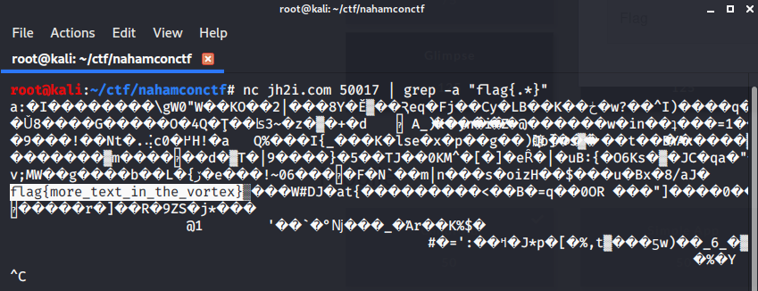
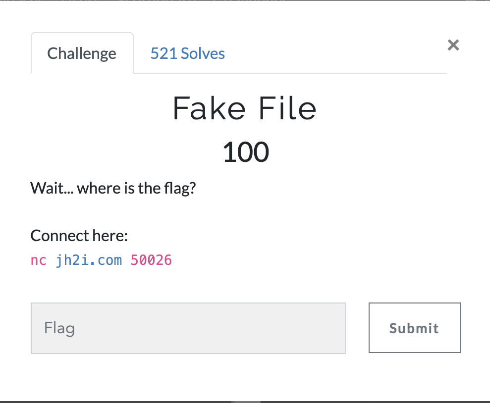
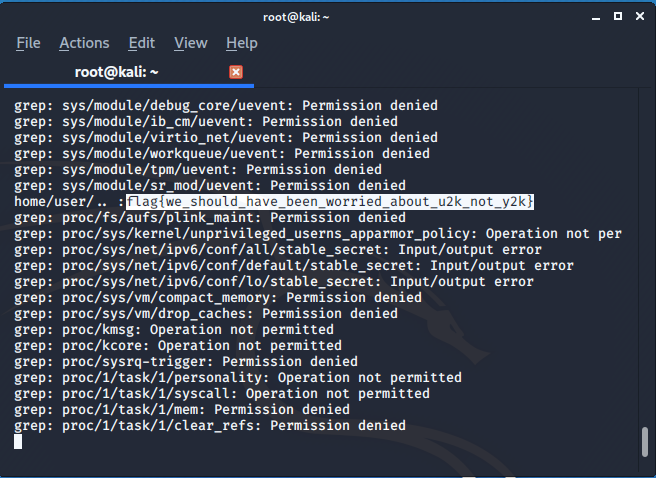
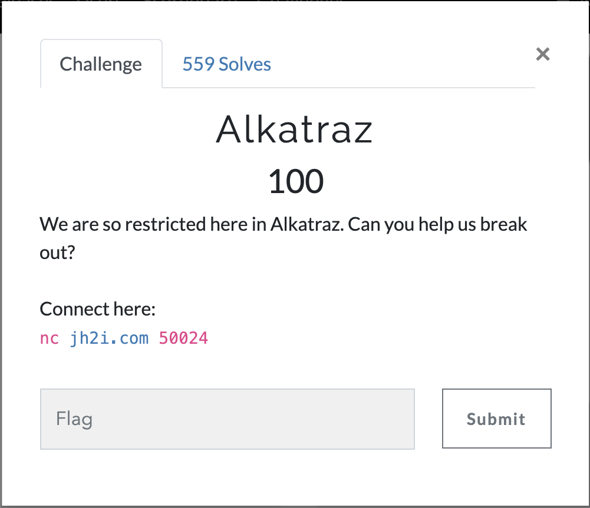
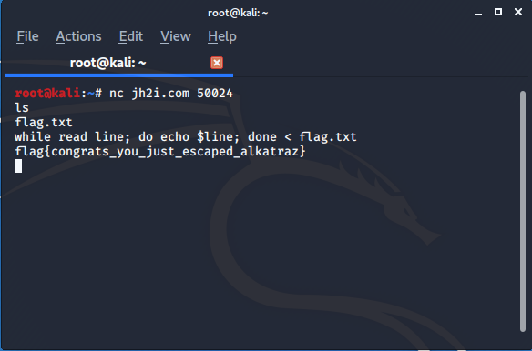

# MISC

## VORTEX

net cat server was given **nc jh2i.com 50017**

>: FLAG : flag{more_text_in_the_vortex}

I simply used grep -a command to search flag in the vortex .
-a forces to print output in a binary file ..



## FAKE FILES  



After connecting to given url we get access to system where there are lots of fake files and flag is inside in one of the sub- directories.

I simply used grep recursively to get the flag

```
grep -r "flag{,*}"

```


## ALKATRAZ  



Once we connect to the url we find the flag is their only inside flag.txt but but most of commands are disabled for opening and reading  the files so after some study from [java-point](https://www.javatpoint.com/bash-read-file) I found that **<** this command can be used and this is not disabled.



