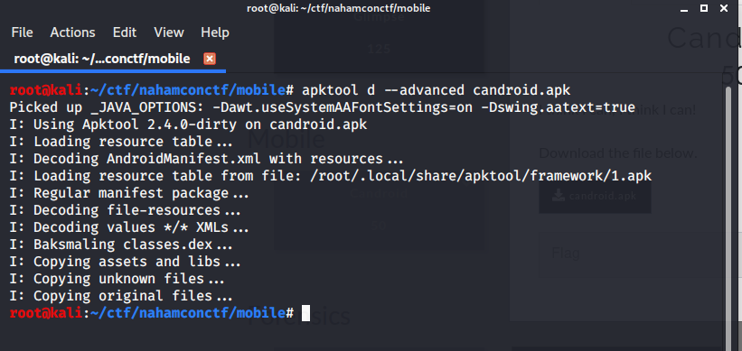
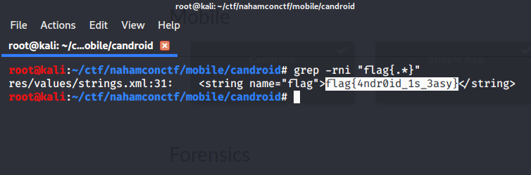
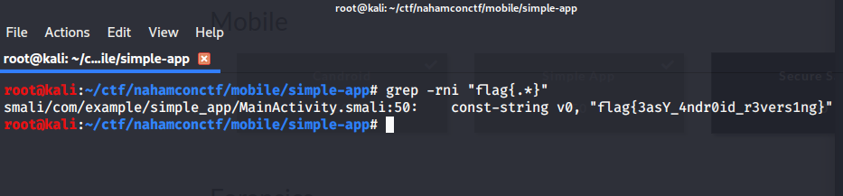

# MOBILE

### CANDROID

A .apk was given , candroid.apk .

>:FLAG : flag{4ndr0id_1s_3asy}

I extracted it using apktool .

And bruteforced to search the flag.

### SIMPLE APP

Full same as CANDROID

>: FLAG : flag{3asY_4ndr0id_r3vers1ng}

