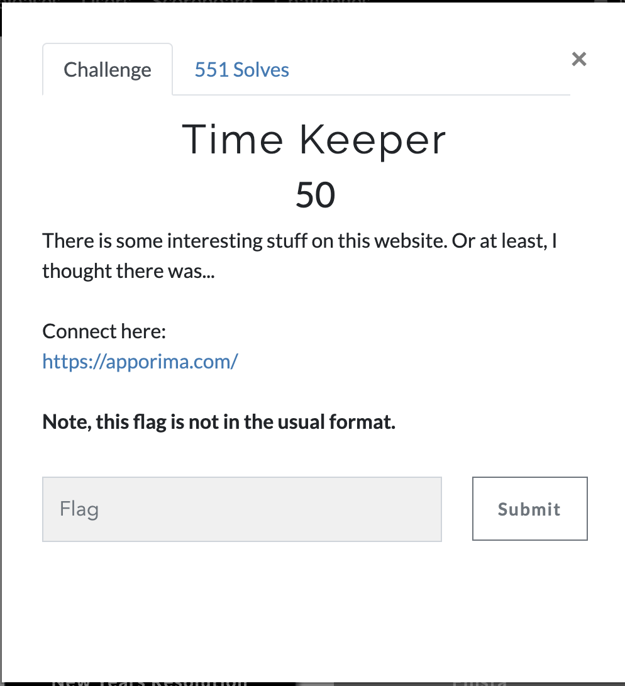
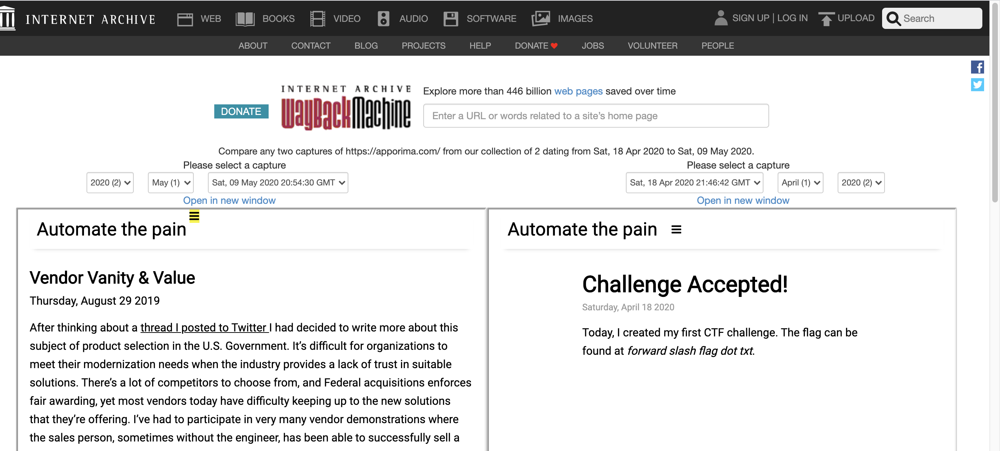
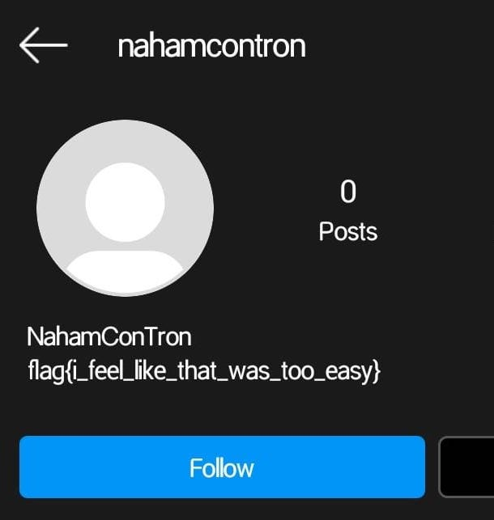

# OSINT

## TIME KEEPER

As the ques name and description suggest that something was changed on the site so I used [wayback](https://web.archive.org/) to see the changes and I found this.

After open the url we got the flag .

## FINSTA

nahamcontron sa name was given.

As problemname clearly indicates  to instagram, so I searched on instagram and found the flag in the bio  

>easy peasy :)

