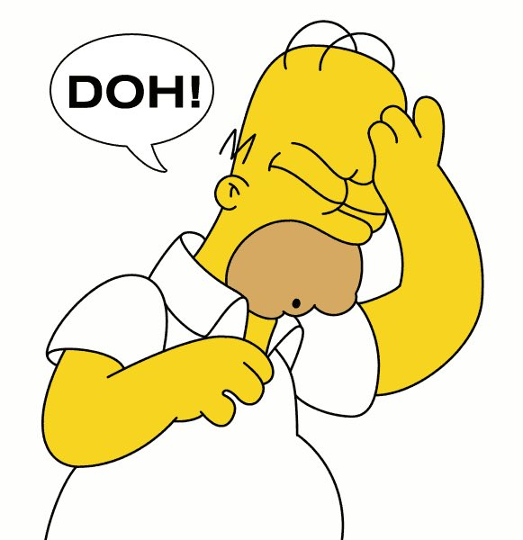

# STEGO

## KSTEG


With the challenge we get this JPEG image:


The challenge name and the challenge description clearly indicates that we need to use [Jsteg](https://github.com/lukechampine/jsteg) this is a tool used  for hiding data in the least segnificant bit (LSB) of the bytes in the image

> The image is actually an image of the creator of the tool (luke),


## DOH

A image was given and seriously what techniques was to be used I used [Steghide](http://steghid.sourceforge.net/download.php) to get the flag and no passphrase was required for this.



```
steghide extract -sf doh.jpg

```

This was the flag : **JCTF{an_annoyed_grunt}**


## Beep Boop


An audio file was given and after listening to it I was sure that this are [DTMF](https://en.wikipedia.org/wiki/Dual-tone_multi-frequency_signaling) tones so I used this [dialabc](http://dialabc.com/sound/detect/index.html) to get the numbers.

```
46327402297754110981468069185383422945309689772058551073955248013949155635325

```
After some observation I found it a decimal to hex converion :


and then hex to ascii


# FORENSICS

## MICROOSOFT

we were just give a  .docx file.

**FLAG : flag{oof_is_right_why_gfxdata_though}**

I first analyzed the file through binwalk, and got so many zipped files.


Then extracted it , and bruteforced to get the flag.


