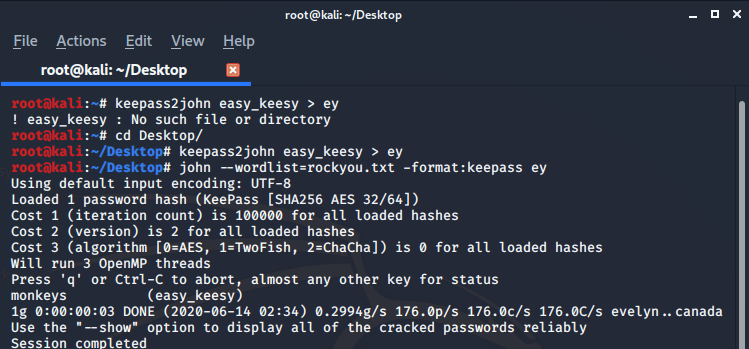

# WARMUP

Almost all the question in the warmup section were easy so I am writing only the solution for two ques which I found unique and fun to solve:


## easy_keesy

A file was given without any specific extension so after using **file** command on it I found that it was Keepass password database 2.x KDBX and it was password protected.

```
file easy_keesy
easy_keesy: Keepass password database 2.x KDBX

```

So I used john the reaper to brute force the password.



> password : monkeys

Once you  get the password you can open the file from any app I used an android app named **keepass**


## PETER RABBIT

This was question was a unique one we were given this image :


During the CTF I was thinking it is related some unique Steganography technique but it was not something like that.

I solved this problem just after the CTF was over by some more research actually it's an **stack-based esoteric programming language** named [piet](https://esolangs.org/wiki/Piet) so you can you use any online decode to decode it.I used this [bertnase](https://www.bertnase.de/npiet/npiet-execute.php) and the flag was **flag{ohhhpietwastherabbit}**
