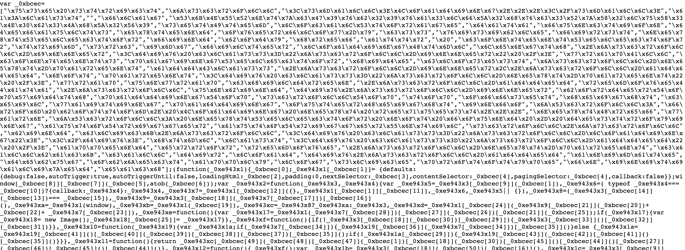

# WEB

## Agent-95

The challenge was pretty simple we have to change the agent name to any old **Window-95** version.I googled for some old agent version of windows and used that to get the flag.

## Localghost

A simple webpage with peculiar scrolling feature from inspectiing the source code I found a link.

After opening the url I found huge amount of  hex value.

Converting the hex into Ascii

Here we got the flag in base64 encoded form after decoding it we get the flag

## Phonebook

After opening the webpage we we were instructed that :

after changing the url phonebook.php we land to :

As the question states *"But you will only get a flag if it is an emergency!"* So I used POSTMAN to send a post request as **emergency=true**

