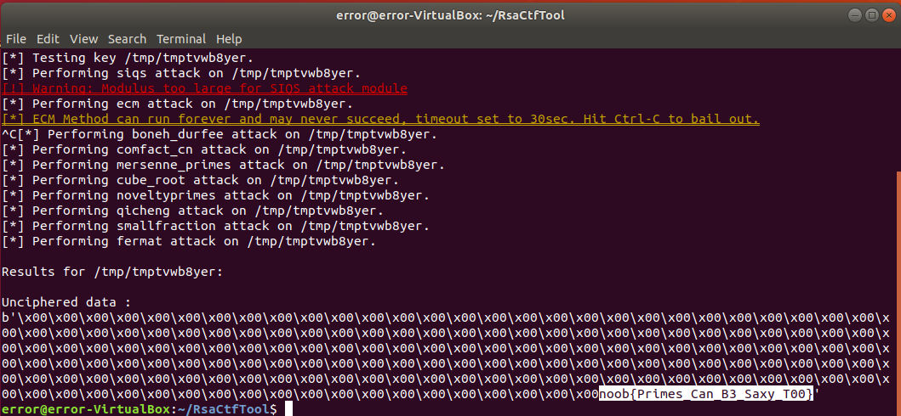
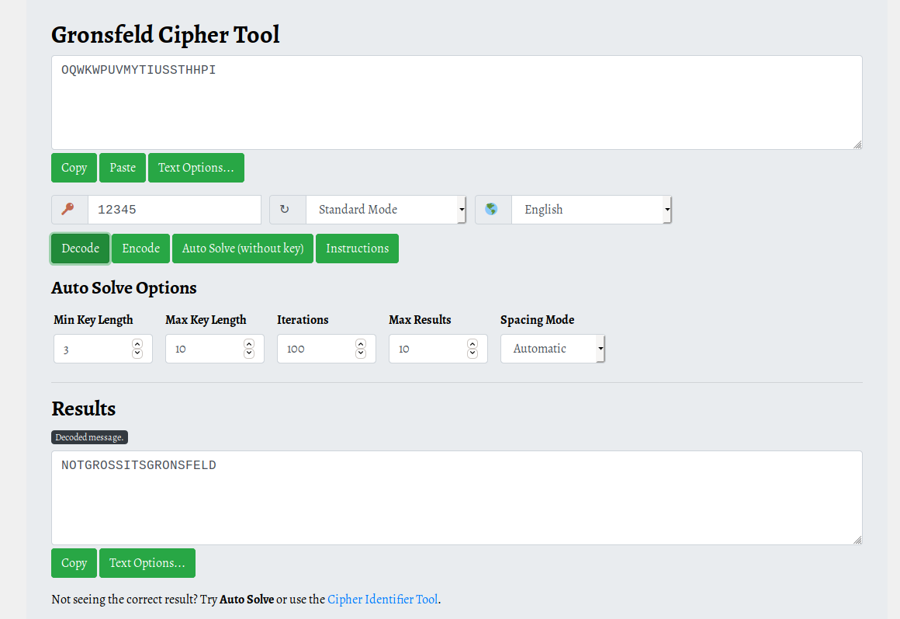
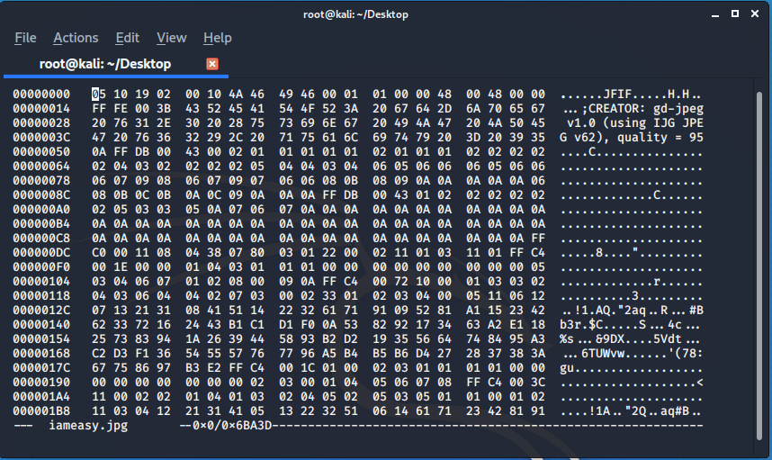
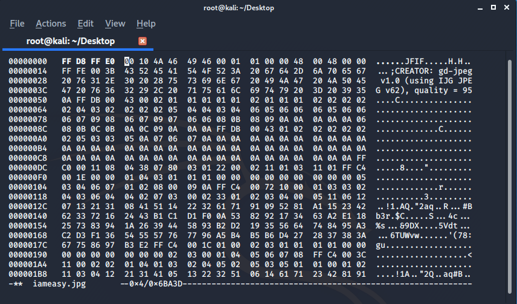
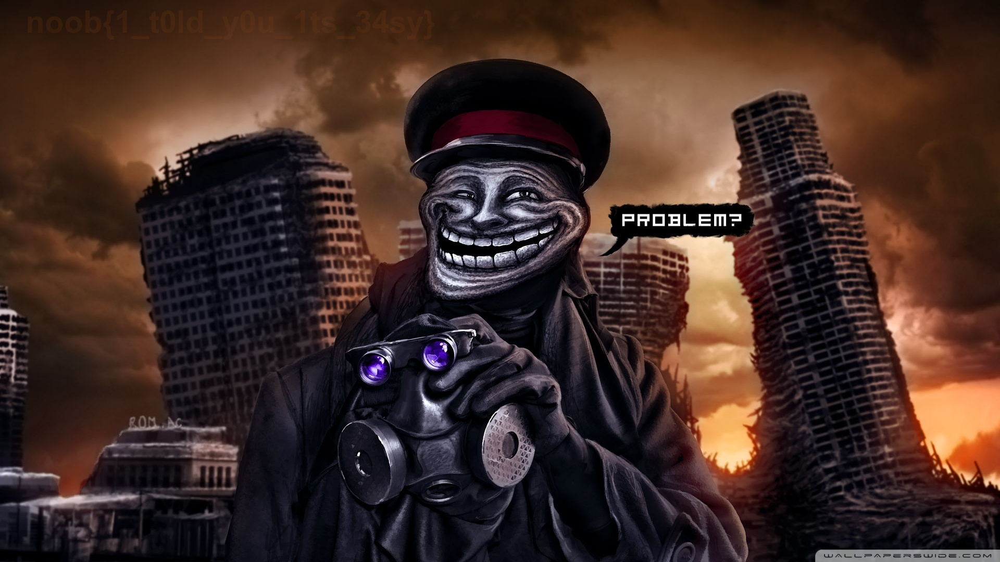
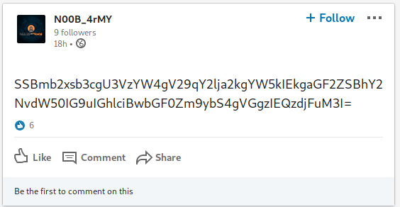

## CRYPTO

### BaseD

A Cipher: **1c@^(9l;sa2c3Ln20_Mf<&&Vs<r** was given with a description :

>A Simple Crypto Based Challenge. Combination of 2 bases :)

I used [cyberchef](https://gchq.github.io/CyberChef/) to solve this it was combination of **base 85 & base 58**


**flag: noob{base58_85}**


## Aar_Ess_Ae 2.0

```
n=1209143407476550975641959824312993703149920344437422193042293131572745298662696284279928622412441255652391493241414170537319784298367821654726781089600780498369402167443363862621886943970468819656731959468058528787895569936536904387979815183897568006750131879851263753496120098205966442010445601534305483783759226510120860633770814540166419495817666312474484061885435295870436055727722073738662516644186716532891328742452198364825809508602208516407566578212780807

e=65537

c=479864533376761605695501447173868480555428955121197237667644363164782871896916177280454277070395501072881821206028710238061428135752902868021510351013602427444705377461961807606024656743172785917677779391848195684330103645049456693618142623342949445393135435605296850775153054696353591431012573391751673267024658145416936335505273041995697052197680305689264142043959382559774510439925577487721780439642813074520685265074584526487330950173513520723457640547997316

```

Without using my brain I set the parameters in [RsaCtfTool](https://github.com/Ganapati/RsaCtfTool)  and got the flag :



### GROSS

A Cipher was given with key 12345.

> OQWKWPUVMYTIUSSTHHPI

**FLAG : noob{NOTGROSSITSGRONSFELD}**

Related to the name i found gronsfeld cipher..

I used this(https://www.boxentriq.com/code-breaking/gronsfeld-cipher) website to decode it..



## FOREINSICS

## It's easy

for this A zip was given after unziping it we got  **.jpg** file but it was not opening so i opened it in hexeditor and found this :



the magic bytes for jpg file was wrong so I changed it to it's correct bytes :



and after that open the image we  got the flag  :




## OSINT

### t4g
```
#we_are_noobarmy

```

Only this was given so at first I started with Instagram  found nothing than I searched  the # in twitter and we found this **1Bs791Hj97cM9rum9ifaUcU9hDPGmUdCf** in one their post and this was **base62** enocded after decoding we get the flag :

**FLAG: noob{B4sE62_4nd_h4shT4g}**


### COMPANY

*Social media platforms are great for promotion of organization like noobarmy_*

Only this was given .

I checked **linkedin** for  noobarmy , I found a post.



It was a  base-64 encryption.After decoding it I received:

**I follow Susan Wojcicki and I have account on her platform. Th3 D3v1n3r**

Now, Susan Wojcicki is CEO of youtube, So I checked for any channel named **Th3 D3v1n3r** and found the flag in of their [video](https://www.youtube.com/watch?v=Vd9t0K5Knww&t=224s) bio .


**flag: noob{i7_wa5_ea5y_T0_f1nd}**
