## REVERSING
### SOLVED IN A FLASH

A data file was given .

**ractf{Fl4shDump5Ar3VeryFun!!}**

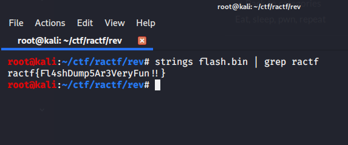

## OSINT

### REMOTE RETREAT

A photo was given , we have the find the location of the photo within 500m
This photo was given .

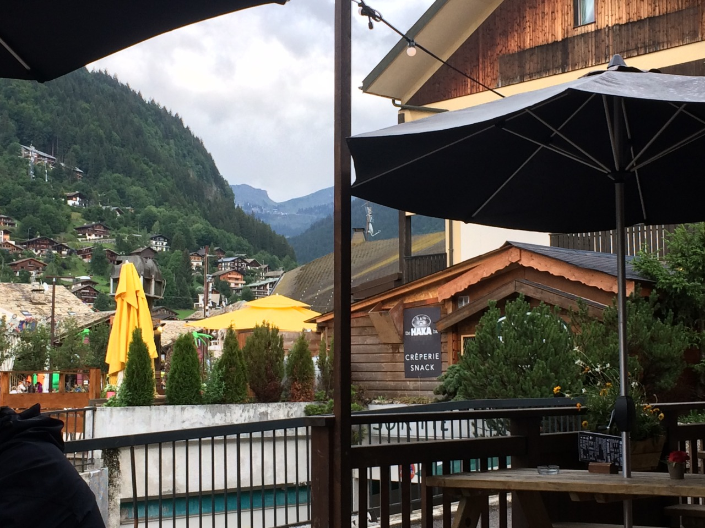

Giving a closer look at the photo, found a bar named The Haka Bar.

Then i used google maps to get the location

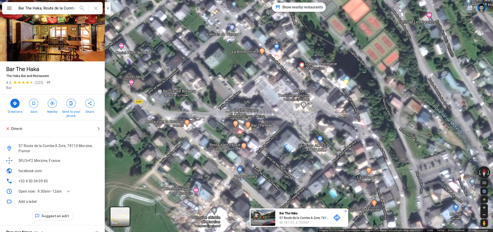

For confirmation i went for a street view.

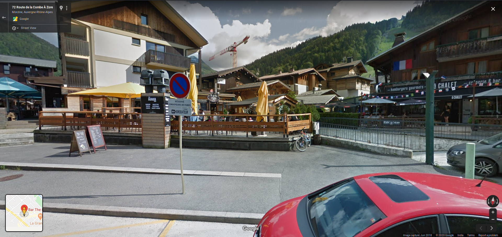

### SUSPENDED BELIEF

Same question type, we have to find the location but within 2km..

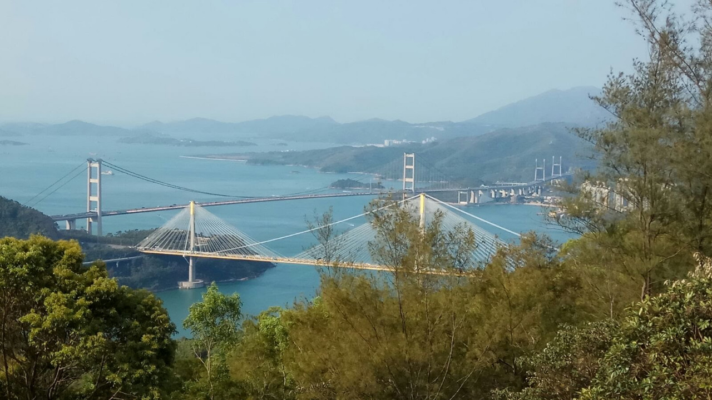

After having some reserach i found out in a chineesse travel agency blog about the bridge ..
I found out to be Tsing Ma Bridge , Hong-Kong


### BRICK BY BRICK

same question type, range 2km..

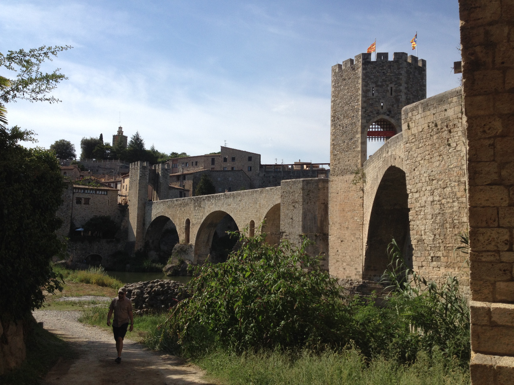

I got the related photo from a spanish travel blog\
Its in a city named Besalu , Spain ..

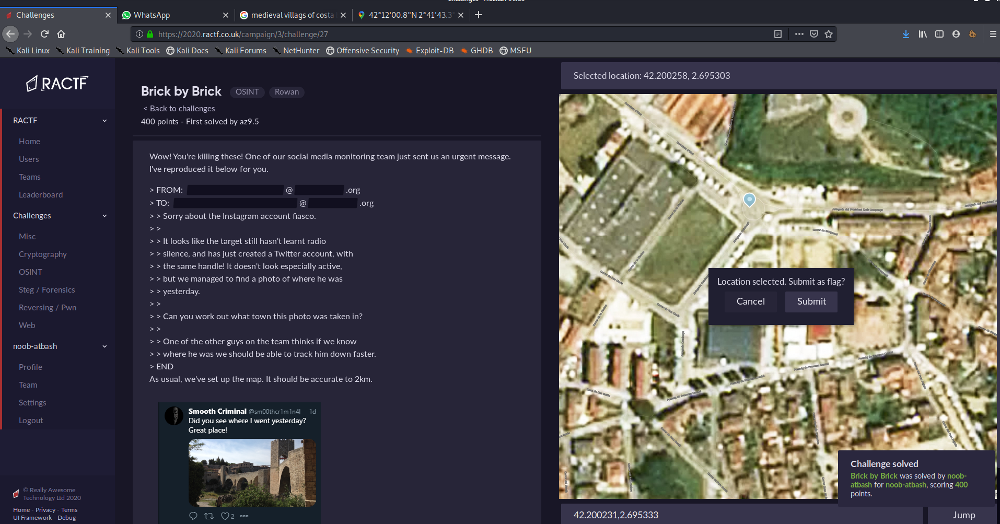

### TREE MAN

same question but range 50m It was the toughest amongst all


The sculpture is not something famousIt is made for halloween in one of the biggest water parks\
in spain , **PORT AVENTURA**

Though I knew the park, it was not easy.
so i searched in instagram #portaventura to get some more\
information..


Here I got a very good view of the background.
And then i atlast found it on gmaps

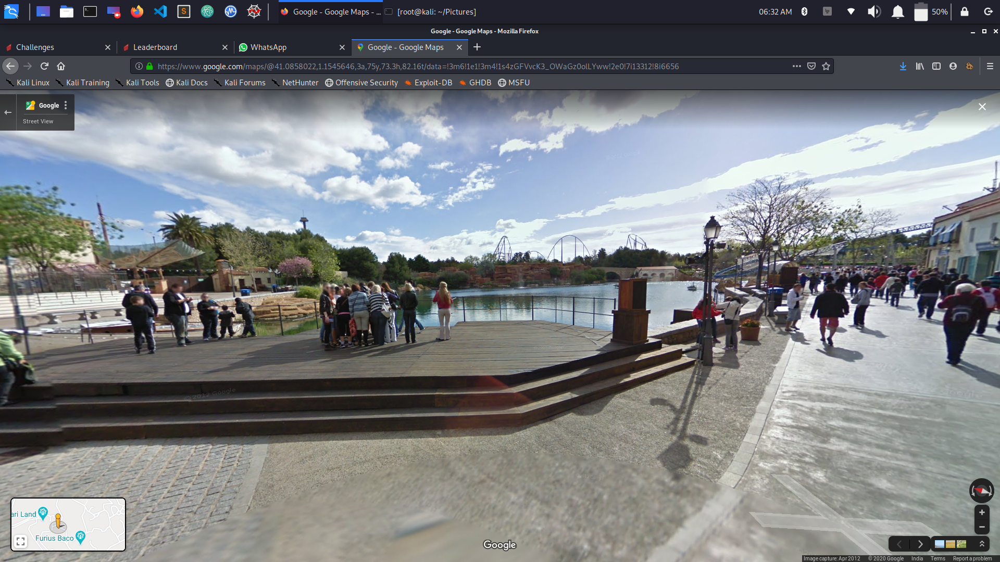

and atlast got the flag.

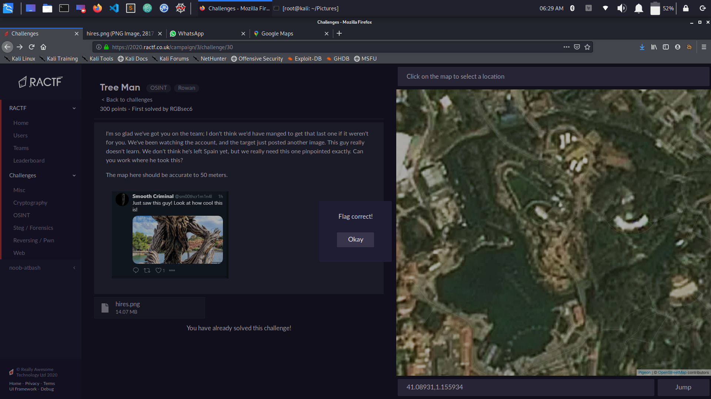


### DEAD MAN

Same question, range 500m.

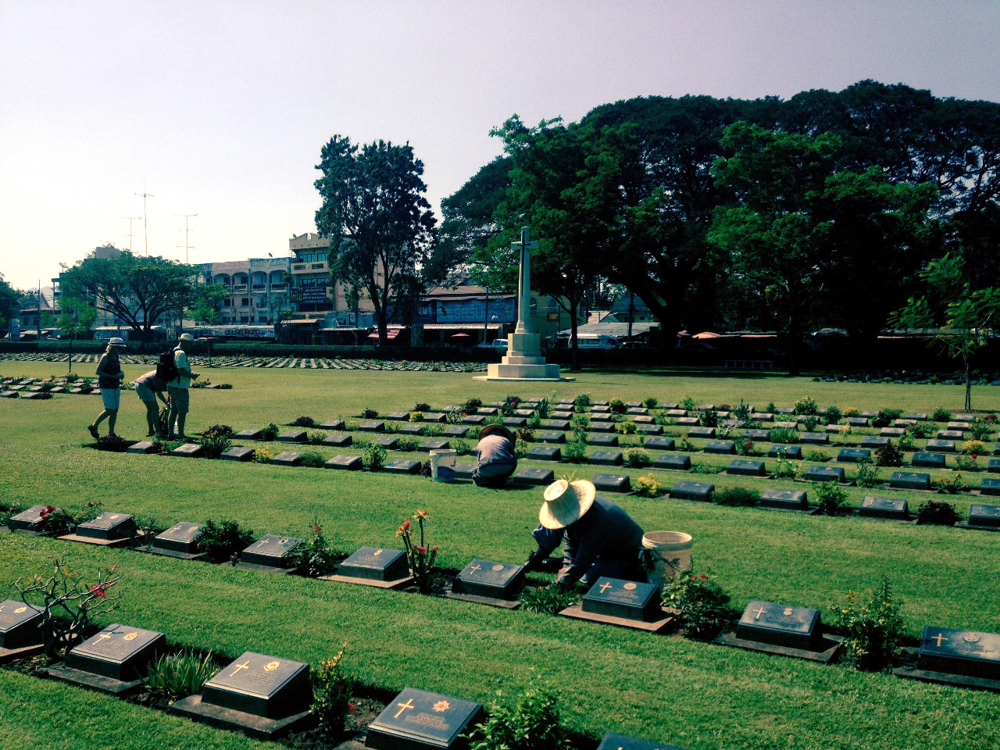

With research i found that it is Kanchaburi War Cemetary, Thailand.

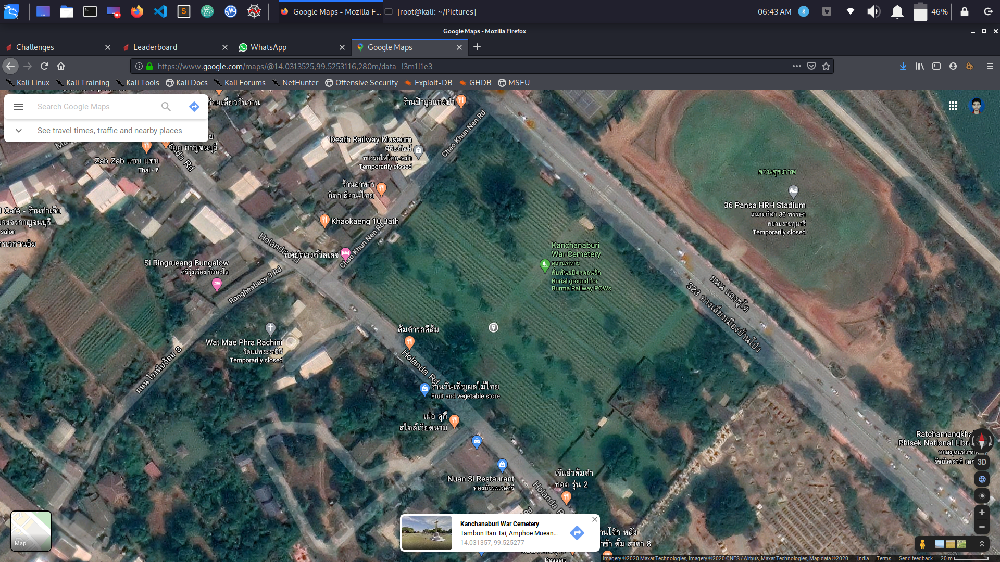

and i got the flag

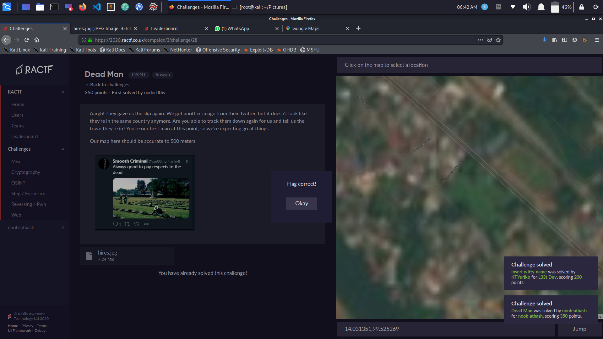

## FORENSICS

### A MONSTER ISSUE

We were given a .mp3 file and said that it contains hidden info.

First I used audacity to analyze the .mp3 but i wont received anything.

then i used binwalk to check the .mp3

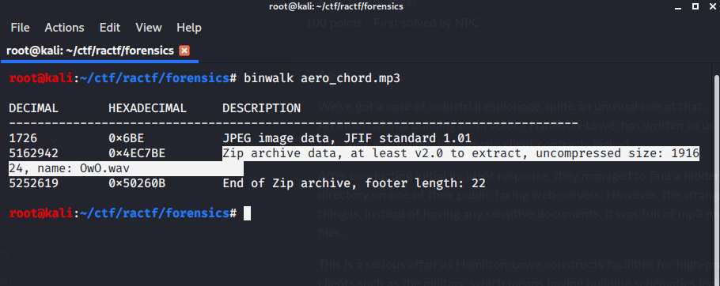

Extracting it i received a .wav file.
analyzing it through audacity i found in spectogram.

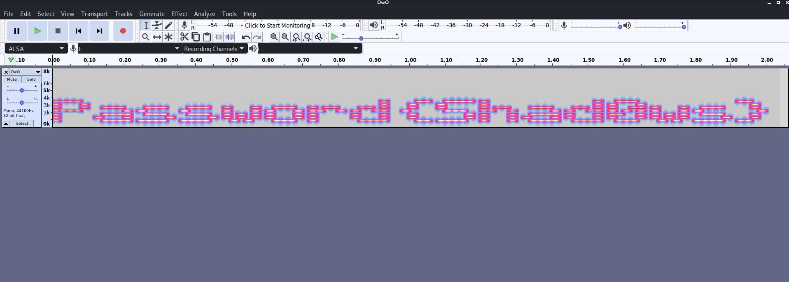

But it was not the flag, then again analyzing **OwO.wav** through binwalk i found .

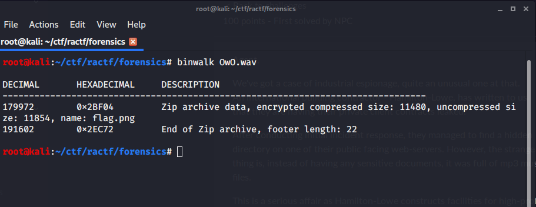

but the zip data was encrypted ,I  extracted it through 7z x.

```
root@kali:~#7z x OwO.png

```
and used the password **Shad0w** and i received flag.png


### CUT SHORT

A PNG file was given which was not opening so I first checked it's magic bytes everything was right I was confused what to do I used an online [tool](https://online.officerecovery.com/pixrecovery/) it's a paid site but give a demo image with watermarks but I was able to get the flag.

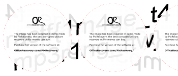

**ractf{1m4ge_t4mp3r1ng_ftw}**


## CRYPTO

### REALLY SIMPLE ALGORITHM

A simple RSA problem was given with the values :

```
p: 11818751839134798003896995777280636710933819841691208802203741558648161569478182842610656541486947380461526236869376828324823442970615053956103658522999657
q: 8080176977261794282393524443550794361811461447133164655168715683072253993704633635567923093279021613973263280694176741117427461240392915209904057854001491
e: 65537
ct: 16396113212669062236278084805791842198508440440923386566433503232598293444511673000158746637041574988239153123677080362414729374184284075430065196457969824470100047167526381522551801158422992268991618368807073600782955870112933074271474746902861058348639518163675771999993640121524895670175520943781973802905

```
I wrote a simple python script to get the flag .
```python
#!/usr/bin/env python3
from sympy import root
from Crypto.Util.number import inverse, long_to_bytes


p=11818751839134798003896995777280636710933819841691208802203741558648161569478182842610656541486947380461526236869376828324823442970615053956103658522999657
q=8080176977261794282393524443550794361811461447133164655168715683072253993704633635567923093279021613973263280694176741117427461240392915209904057854001491
e = 65537
c=16396113212669062236278084805791842198508440440923386566433503232598293444511673000158746637041574988239153123677080362414729374184284075430065196457969824470100047167526381522551801158422992268991618368807073600782955870112933074271474746902861058348639518163675771999993640121524895670175520943781973802905


n=p*q


phi = (p - 1) * (q - 1)
d = inverse(e, phi)


m = pow(c, d, n)
flag = long_to_bytes(m).decode()
print(flag)

```
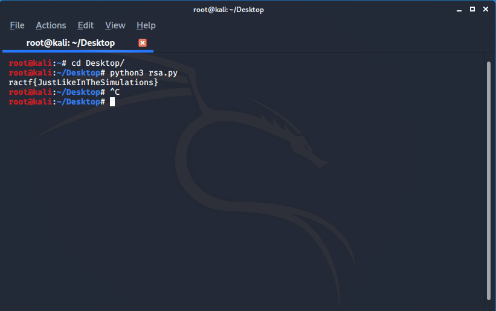

### REALLY SMALL ALGORITHM

```
n: 150596748398447336876163683589791098984780756759390855801453676694100728921358690373126332213610181814006233650025193853192540490364333049401732750426127779
e: 65537
ct: 8671589509271111894319284866424617433585110752785155192830830744297539816821310272717080419560123033763841972899317716051536620764190152794808418218345098
```

for this RSA problem I just use [RsaCtfTool](https://github.com/Ganapati/RsaCtfTool) to get the flag.

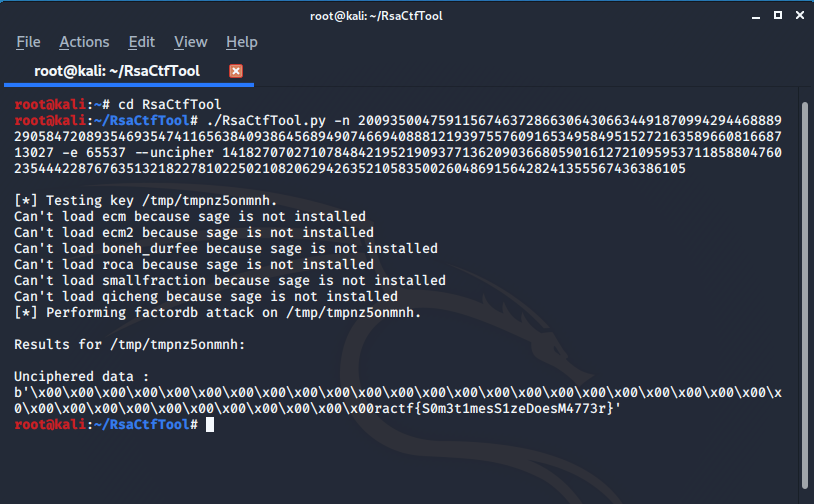

### CRYPTO 01

```
LHFKM GMRHC FLMMJ ULXFY JOUFC
FQFXF ZJOKP JOMMU LMRJT FFTBA
JYFFR JZFXG AWJCB ULXFI FFKRF
KPGKH RFWCF MTFRR LHFRI FMQFF
KFLWU JMUFC IOMMU FYCFF KWCYB
MFPQF CFHJG KHMJK FFPMJ PFWCY
BMMUF TMJQJ CVJOM GZMUF CFRRJ
TFMUG KHGAA FHLAH JGKHJ KLKPH
FMMUF TLCCF RMFPK JCTLA YMUFW
CYBMJ HCLBU YMFLT QJOAP PJMUG
RIOMM UFYXF LAAPF WGPFP LMMUF
RLTFM GTFMJ HJJKL KOLAA FLXFI
FRMJZ AOWVL HFKMI MUFRF WCFMW
JPFGR PJWOT FKMR

```

As by seeing the cipher text it's quite difficult to tell the cipher name so I use a cipher analyser [boxentriq](https://www.boxentriq.com/code-breaking/cipher-identifier) it gives it was a **mono alphabetic substitution** cipher so use used tool available  [boxentriq](https://www.boxentriq.com/code-breaking/cipher-identifier) and the result was

```
agent its great to have you here weve found out that some employ ees of evil cor p have been sending secret messages between each other but theyre encrypt ed were going to need to de crypt them to work out if theres something illegal going on and get them arrested normal y the crypt ography team would do this but theyve all decided at the same time to go on an ual leave best of luck agent b the secret code is documents

```

**flag: ractf{documents}**


### CRYPTO 02:

```

KFCHT QXXKR FSAHX IEIYP GYZRX
YXCKK OKYPG YLNIX BQRFU WFKEH
LNYGC VBDGT NVIMF NJJLV HJEJY
PGZFO IKQTL KBJKW TXNEH FVEHD
PQJBG MYEYW IPLRC YNWPM YEKNV
CEKRF SAHXI MFDVG XUTTG MRXIF
TWUGW ZNUJZ UHEBJ FKWLV MDECT
BTHGF VMTGP JFZUM FHFAM UNJPN
HQQGJ AGTCV MYEVZ IPMZT NJAQY
DOSJG DXZNL RWXXU AWTCP WZFDT
CCKVA AFQNT SLJBM ETEAW FVIXR
MJJBK GXPTN VVTED HTURE VTJYP
GWVAQ DWWKJ DTSVK X

```
Using the same method for this cipher I found it was **vigener cipher** and after decoding I got this.


```
rocco ive transfer ed the first part of the funds to your account but im going to need to see the good first before we can complete the transaction the final transfer may need to be performed in person be a c use my zurich bank appears to have suspicions about the quantities of money being moved around if you are available we can a range a meeting point and complete the deal yours don nie

```
>hint was given: The flag is the location of the bank

**flag: ractf{zurich}**
