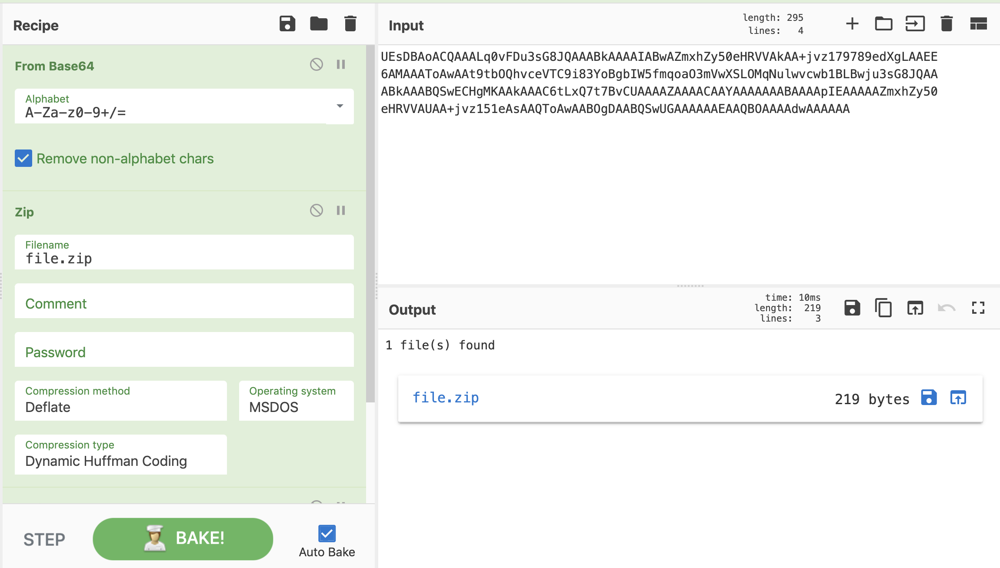

# FOREINSICS

## KatyCat


**zh3r0{1sn7_st3g4n0_e4sy}**

With the ques this image was given :


I used some tool like  exif, binwalk and finally after using **zsteg** I found a [url](https://pastebin.com/hvgCXNcP)


On visting the given url we were given this :

```
UEsDBAoACQAAALq0vFDu3sG8JQAAABkAAAAIABwAZmxhZy50eHRVVAkAA+jvz179789edXgLAAEE
6AMAAAToAwAAt9tbOQhvceVTC9i83YoBgbIW5fmqoaO3mVwXSLOMqNulwvcwb1BLBwju3sG8JQAA
ABkAAABQSwECHgMKAAkAAAC6tLxQ7t7BvCUAAAAZAAAACAAYAAAAAAABAAAApIEAAAAAZmxhZy50
eHRVVAUAA+jvz151eAsAAQToAwAABOgDAABQSwUGAAAAAAEAAQBOAAAAdwAAAAAA

```
At first it was difficult to guess so I began with **base64** decoding


As we can see the first letter **PK** which are the starting magic bytes of **zip** file so we need to enocde the data in zip file save it as zip  you can use any hexeditor for this job but [cyberchef](https://gchq.github.io/CyberChef/) can do the same job for us so



Once we get the zip file when I tried to open it, it was password protected so I used **john** to crack the password and it was very easy :


> password : kitkat


Once we unlock the zip file and open the flag.txt  we found this :

```
K9bC_L`D?f0DEb8c?_06cDJN

```


A **rot47** cipher easy to crack :


## LSB Fun


**zh3r0{j5t3g_i5_c00l}**

When we download the zip file and unzip we found this image :


As the challenge description suggest its **jpg** LSB Stego ques so I began with tool [jsteg](https://github.com/lukechampine/jsteg), and at one shot I found the flag :


## Snow


We were given a zip file after unziping we found a normal txt file name **chall.txt** and there some fake files with flags there was also a txt file name **secret.txt** after opening it we found

```
welc0me_to_zh3r0_ctf

````

This also seems to be normal so once again going the challenge name I found it was a [snow steganography](http://www.darkside.com.au/snow/)  so we can get the hidden text using [stegsnow](http://manpages.ubuntu.com/manpages/bionic/man1/stegsnow.1.html) but for this we need a password so once rewinding the cracking process we have a **secret.txt** file so, I tried this *welc0me_to_zh3r0_ctf* as a password and go the flag :


## is it a Troll


**zh3ro{y0u_got_th3_k3y}**

A image was provided in this challenge :


Actually it was zip file so let's rename it to **.zip** extension  after this when I tried to  open it there was password protected **troll.png**   so where is the password ?

So I run **exiftool** on the original image which was provided to us :


So in Author secetion I found a encoded text so again with the help of [cyberchef](https://gchq.github.io/CyberChef/) I found it was base62 encoded

>pass : itrolledyou


Lets open the image after open the image I found this image :


Since there is no flag I run the **zsteg** and again I found a encoded text :


It was **base64** encoded after decoding it we get the flag :


## Hashtad

When we connect to this **nc crypto.zh3r0.ml 7419** we get the a value for N and ct but it is different each time also mentioned in the question description so first understand : 


### HAstad's broadcast attack

Suppose Alice sends an unpadded message M to k people P1, P2, ..., Pk each using a same small public key exponent e and different moduli N for ith individual, the public key for ith individual (Ni, e). The attack states that as soon as k >= e, the message M is no longer secure and we can recover it easily using [Chinese Remainder Theorem](https://crypto.stanford.edu/pbc/notes/numbertheory/crt.html).

Let us understand this attack using an example: Alice sends a message M to 3 three different people using the same public key exponent e = 3. Let the ciphertext received by ith receiver be Ci where Ci = M3 mod Ni. We have to assume that gcd(Ni, Nj) == 1 where i != j

Quick Question: What if GCD(Ni, Nj) != 1?
Then the moduli pair (Ni, Nj) is vulnerable to Common Prime Attack

We can now write:


Thus we can get the following by solving using Chinese Remainder Theorem:

where bi = N/Ni, bi' = bi-1 mod Ni and N = N1* N2* N3. Since we know that M < Ni (If our message M is larger than the modulus N, then we won't get the exact message when we decrypt the ciphertext, we will get an equivalent message instead, which is not favourable).
Therefore we can write M < N1N2N3. We can easily calculate M now by directly taking the cube root of M3 to get M

I took this source from [wikipedia](https://en.wikipedia.org/wiki/Coppersmith%27s_attack#H%C3%A5stad's_broadcast_attack) and if you don't understand in a brief you can watch this [video](https://www.youtube.com/watch?v=aS57JCzJw_o).

So I took the first three N and ct which I got from the connection and put that on my script :


```python
#!/usr/bin/env python

e=5
n1=27704869302997392661657220866050898311244838064441841646219678939774022015189626988458013202055324121575178127785443104668568510154290862546385050192223834526533281019024832529003150889500239003997193433681439748742863667885884600761042973805747444151235119630692023497480373605174402083098784774260598500704204830838640452269557422523956579822333927103206032036790181056467053386587027251158732706542157785630247314811143864496648816832586752499970199993966197104172410676580459219755530100423097826697748734779914994258710204732420553267648117419471192908008756826863301494775515247397371101890288434484387008318743
n2=18651004307844646259253649467383147390293431742886493780526133996712908761810086744997747335569632407437212644550340369838116874964948323587041960345450410142633430356737029425417459254783461252914597639579112148306592186296779131520793551620503311489667794362306293712052220490468117264617739925695016019122544994872879068818245522425978717883220690213600472538101921977584498265882956199956703716669750769096341354262168846550907912170702820015467641766873279564440334244408410435872220572814875437403601211737596168757767933294833149221910290585495435854967743523179774814425140387974268925157907543717319979278719
c1=9100754579960236848352128054287238406518105657996793847042595697144965162971810789023005958434542782139419200292385624128793400495984695042499402140947720400926053734800588304911042534572527671927071425093365485018366946711031154870070910307305216329688646538898982338573743976640389466085990407358585972809298867044207357016401794771653257186034143856968654099977421129985001327799621373780729741636442969340198189167590231239916057678062125002109009684515243374228969939198046099672731859350935900149976041036908956553725645311248475574088657714812531717222416775378628522540222133026658696543077525635017217392437
c2=8555874836128783569299328316905700097820370889862249687656401811689201969340059759470306042227615208047888480821124458105773907135957621062084923052879044448611667515545398399275426849365230162497252176546573170412394779154272570009465577753368676976444556464526347202426210827020169367425914920532557858421994076126134646682090645762285020165611566574053289404927971530887948649542023169562267822838992653800337218584043277983382558007372625052640015477788727480702287209233827462447710490790251829178713360054812714500326233489354846466758573241051407301439246706145740372860402726735258439589880979136520944468902
n3=24702421814821836551903876433224441074579464425274807301602422274038708759438641872510368628132499229979420916628282582157722658313352029926755909471442340622129752553326773066140378441868139065306731608777607548722369268018333206018289506152997253107921044917595876863895452191596124467001954775620593105294774773413640377751738878199324453201585436924334771374746229187904644477429071165417097190503460272061672679762454409236497175611985788128943271731991541469650278221026831372562966311745260077989632782363997836745406747629278499078048217779690323347804954969904590610003564200456442837270462227214001173767183
c3=14315319233498245395263674164225062334251637910061051753261197026580757254328378604568391817771590784038617756390924363034204721850704290348612525361015565151612620198104497750731816309767627241720990644792916310043483320833997430907553486758349900800169718013446807990051723530757102168568646751631028050067866589759221747909879360869020857004479093786528980984079345312959763130972539963129766332719433415696702425763993856436414674893439295873955963308841672466031098222169231888069993944570845428573287212985131141653651256569910823943851705442710743871882079432157775730854186954499281759332791012461346368657277


def chinese_remainder(n, a):
    sum = 0
    prod = reduce(lambda a, b: a*b, n)
    for n_i, a_i in zip(n, a):
        p = prod / n_i
        sum += a_i * mul_inv(p, n_i) * p
    return sum % prod

def mul_inv(a, b):
    b0 = b
    x0, x1 = 0, 1
    if b == 1: return 1
    while a > 1:
        q = a / b
        a, b = b, a%b
        x0, x1 = x1 - q * x0, x0
    if x1 < 0: x1 += b0
    return x1

def find_invpow(x,n):
    """Finds the integer component of the n'th root of x,
    an integer such that y ** n <= x < (y + 1) ** n.
    """
    high = 1
    while high ** n < x:
        high *= 2
    low = high/2
    while low < high:
        mid = (low + high) // 2
        if low < mid and mid**n < x:
            low = mid
        elif high > mid and mid**n > x:
            high = mid
        else:
            return mid
    return mid + 1

flag_cubed=chinese_remainder([n1,n2,n3],[c1,c2,c3])
flag=find_invpow(flag_cubed,5)

print "flag: ",hex(flag)[2:-1].decode("hex")

```

Since no value for **e** was given so at first I tried with **e=3**


but it didn't worked so I set it to **e=5**


# Subset of subset of hacking machines challenges

Only This url was given : **hackit.zh3r0.ml** in almost all the problem in this section

So I began with basic **namp** scan

## FLAG 5

**FLAG : z3hr0{shouldve_added_some_filter_here}**\

> NMAP RESULT


from result we found a http port 22 was open
So let's see what's their :

```bash
root@kali:~/ctf/zh3r0ctf# curl hackit.zh3r0.ml:22
z3hr0{shouldve_added_some_filter_here}
root@kali:~/ctf/zh3r0ctf#

```

## FLAG 1
**FLAG: zh3r0{pr05_d0_full_sc4n5}**
For flag1 i just did a full nmap scan for more information and we got the flag

```bash
root@kali:~# nmap -p- -sV -A -sT hackit.zh3r0.ml
Starting Nmap 7.80 ( https://nmap.org ) at 2020-06-17 21:21 IST
Failed to resolve "hackit.zh3r0.ml".
WARNING: No targets were specified, so 0 hosts scanned.
Nmap done: 0 IP addresses (0 hosts up) scanned in 10.49 seconds
root@kali:~# nmap -p- -sV -A -sT 139.59.3.42
Starting Nmap 7.80 ( https://nmap.org ) at 2020-06-17 21:22 IST
Nmap scan report for 139.59.3.42
Host is up (0.063s latency).
Not shown: 65527 closed ports
PORT      STATE    SERVICE    VERSION
21/tcp    open     tcpwrapped
22/tcp    open     http       PHP cli server 5.5 or later
|_http-title: Site doesn't have a title (text/html; charset=UTF-8).
|_ssh-hostkey: ERROR: Script execution failed (use -d to debug)
25/tcp    filtered smtp
99/tcp    open     ssh        OpenSSH 7.6p1 Ubuntu 4ubuntu0.3 (Ubuntu Linux; protocol 2.0)
| ssh-hostkey:
|   2048 70:78:8f:70:79:59:72:5f:05:c9:2a:63:b4:34:c1:52 (RSA)
|   256 08:6d:42:16:2a:47:ae:b4:d7:fa:35:28:91:67:ab:63 (ECDSA)
|_  256 e4:89:6b:09:37:64:c2:47:01:bd:c2:32:d8:cd:06:2d (ED25519)
324/tcp   open     ftp        vsftpd 3.0.3
|_ftp-anon: Anonymous FTP login allowed (FTP code 230)
| ftp-syst:
|   STAT:
| FTP server status:
|      Connected to ::ffff:157.35.228.17
|      Logged in as ftp
|      TYPE: ASCII
|      No session bandwidth limit
|      Session timeout in seconds is 300
|      Control connection is plain text
|      Data connections will be plain text
|      At session startup, client count was 3
|      vsFTPd 3.0.3 - secure, fast, stable
|_End of status
554/tcp   open     rtsp?
4994/tcp  open     unknown
| fingerprint-strings:
|   GenericLines, GetRequest, HTTPOptions:
|     ~~~~~~~~~~~~~~~~~~~~~~~~~~~~~~~~~~~~~~~~~~~~~~~~~~~~~~~~~~                                                                                                               
|     ||Employee Entry||                                                                                                                                                       
|     ----------------------------------------------------------                                                                                                               
|     Sherlock Holmes Inc.                                                                                                                                                     
|     ~~~~~~~~~~~~~~~~~~~~~~~~~~~~~~~~~~~~~~~~~~~~~~~~~~~~~~~~~~                                                                                                               
|     Here's a free flag for you, just for finding this door! Flag 1: zh3r0{pr05_d0_full_sc4n5}                                                                                
|     Heyo, Watcha looking at? Employee ID yoo! :                                                                                                                              
|     away kiddo, huh, Kids these days!
|   NULL:
|     ~~~~~~~~~~~~~~~~~~~~~~~~~~~~~~~~~~~~~~~~~~~~~~~~~~~~~~~~~~
|     ||Employee Entry||
|     ----------------------------------------------------------
|     Sherlock Holmes Inc.
|     ~~~~~~~~~~~~~~~~~~~~~~~~~~~~~~~~~~~~~~~~~~~~~~~~~~~~~~~~~~
|     Here's a free flag for you, just for finding this door! Flag 1: zh3r0{pr05_d0_full_sc4n5}
|_    Heyo, Watcha looking at? Employee ID yoo! :
11211/tcp filtered memcache
1 service unrecognized despite returning data. If you know the service/version, please submit the following fingerprint at https://nmap.org/cgi-bin/submit.cgi?new-service :
SF-Port4994-TCP:V=7.80%I=7%D=6/17%Time=5EEA3D89%P=x86_64-pc-linux-gnu%r(NU
SF:LL,18C,"\n~~~~~~~~~~~~~~~~~~~~~~~~~~~~~~~~~~~~~~~~~~~~~~~~~~~~~~~~~~\n\
SF:x20\x20\x20\x20\x20\x20\x20\x20\x20\x20\x20\x20\x20\x20\x20\x20\x20\x20
SF:\x20\x20\x20\|\|Employee\x20Entry\|\|\n\n------------------------------
SF:----------------------------\n\x20\x20\x20\x20\x20\x20\x20\x20\x20\x20\
SF:x20\x20\x20\x20\x20\x20\x20\x20\x20\x20\x20Sherlock\x20Holmes\x20Inc\.\
SF:n~~~~~~~~~~~~~~~~~~~~~~~~~~~~~~~~~~~~~~~~~~~~~~~~~~~~~~~~~~\nHere's\x20
SF:a\x20free\x20flag\x20for\x20you,\x20just\x20for\x20finding\x20this\x20d
SF:oor!\x20Flag\x201:\x20zh3r0{pr05_d0_full_sc4n5}\nHeyo,\x20Watcha\x20loo
SF:king\x20at\?\x20Employee\x20ID\x20yoo!\x20:\x20\n")%r(GenericLines,1B1,
SF:"\n~~~~~~~~~~~~~~~~~~~~~~~~~~~~~~~~~~~~~~~~~~~~~~~~~~~~~~~~~~\n\x20\x20
SF:\x20\x20\x20\x20\x20\x20\x20\x20\x20\x20\x20\x20\x20\x20\x20\x20\x20\x2
SF:0\x20\|\|Employee\x20Entry\|\|\n\n-------------------------------------
SF:---------------------\n\x20\x20\x20\x20\x20\x20\x20\x20\x20\x20\x20\x20
SF:\x20\x20\x20\x20\x20\x20\x20\x20\x20Sherlock\x20Holmes\x20Inc\.\n~~~~~~
SF:~~~~~~~~~~~~~~~~~~~~~~~~~~~~~~~~~~~~~~~~~~~~~~~~~~~~\nHere's\x20a\x20fr
SF:ee\x20flag\x20for\x20you,\x20just\x20for\x20finding\x20this\x20door!\x2
SF:0Flag\x201:\x20zh3r0{pr05_d0_full_sc4n5}\nHeyo,\x20Watcha\x20looking\x2
SF:0at\?\x20Employee\x20ID\x20yoo!\x20:\x20\nGo\x20away\x20kiddo,\x20huh,\
SF:x20Kids\x20these\x20days!\n")%r(GetRequest,1B1,"\n~~~~~~~~~~~~~~~~~~~~~
SF:~~~~~~~~~~~~~~~~~~~~~~~~~~~~~~~~~~~~~\n\x20\x20\x20\x20\x20\x20\x20\x20
SF:\x20\x20\x20\x20\x20\x20\x20\x20\x20\x20\x20\x20\x20\|\|Employee\x20Ent
SF:ry\|\|\n\n----------------------------------------------------------\n\
SF:x20\x20\x20\x20\x20\x20\x20\x20\x20\x20\x20\x20\x20\x20\x20\x20\x20\x20
SF:\x20\x20\x20Sherlock\x20Holmes\x20Inc\.\n~~~~~~~~~~~~~~~~~~~~~~~~~~~~~~
SF:~~~~~~~~~~~~~~~~~~~~~~~~~~~~\nHere's\x20a\x20free\x20flag\x20for\x20you
SF:,\x20just\x20for\x20finding\x20this\x20door!\x20Flag\x201:\x20zh3r0{pr0
SF:5_d0_full_sc4n5}\nHeyo,\x20Watcha\x20looking\x20at\?\x20Employee\x20ID\
SF:x20yoo!\x20:\x20\nGo\x20away\x20kiddo,\x20huh,\x20Kids\x20these\x20days
SF:!\n")%r(HTTPOptions,1B1,"\n~~~~~~~~~~~~~~~~~~~~~~~~~~~~~~~~~~~~~~~~~~~~
SF:~~~~~~~~~~~~~~\n\x20\x20\x20\x20\x20\x20\x20\x20\x20\x20\x20\x20\x20\x2
SF:0\x20\x20\x20\x20\x20\x20\x20\|\|Employee\x20Entry\|\|\n\n-------------
SF:---------------------------------------------\n\x20\x20\x20\x20\x20\x20
SF:\x20\x20\x20\x20\x20\x20\x20\x20\x20\x20\x20\x20\x20\x20\x20Sherlock\x2
SF:0Holmes\x20Inc\.\n~~~~~~~~~~~~~~~~~~~~~~~~~~~~~~~~~~~~~~~~~~~~~~~~~~~~~
SF:~~~~~\nHere's\x20a\x20free\x20flag\x20for\x20you,\x20just\x20for\x20fin
SF:ding\x20this\x20door!\x20Flag\x201:\x20zh3r0{pr05_d0_full_sc4n5}\nHeyo,
SF:\x20Watcha\x20looking\x20at\?\x20Employee\x20ID\x20yoo!\x20:\x20\nGo\x2
SF:0away\x20kiddo,\x20huh,\x20Kids\x20these\x20days!\n");
OS fingerprint not ideal because: Didn't receive UDP response. Please try again with -sSU
No OS matches for host
Network Distance: 17 hops
Service Info: OSs: Linux, Unix; CPE: cpe:/o:linux:linux_kernel

TRACEROUTE (using proto 1/icmp)
HOP RTT      ADDRESS
1   0.88 ms  10.0.2.1
2   7.28 ms  192.168.43.252
3   ...
4   51.09 ms 10.72.195.10
5   50.76 ms 172.25.59.202
6   51.12 ms 172.25.59.203
7   56.44 ms 172.26.55.6
8   ... 16
17  83.76 ms 139.59.3.42

OS and Service detection performed. Please report any incorrect results at https://nmap.org/submit/ .
Nmap done: 1 IP address (1 host up) scanned in 551.86 seconds
root@kali:~#
```

## FLAG 2

**FLAG : zh3r0{You_know_your_shit}**

from the full nmap  scan I got many ports open so I tried this :

```
324/tcp   open     ftp        vsftpd 3.0.3
|_ftp-anon: Anonymous FTP login allowed (FTP code 230)

```
ftp login was allowed with username : **anonymous** on port 324.
just leave the password blank.

```
root@kali:~/ctf/zh3r0ctf# ftp -p  139.59.3.42 324
Connected to 139.59.3.42.
220 (vsFTPd 3.0.3)
Name (139.59.3.42:root): anonymous
331 Please specify the password.
Password:
230 Login successful.
Remote system type is UNIX.
Using binary mode to transfer files.
ftp>
```
then i wandered over the ftp server to gather data ..
```
ftp> ls -a
227 Entering Passive Mode (139,59,3,42,68,76).
150 Here comes the directory listing.
drwxr-xr-x    3 ftp      ftp          4096 Jun 16 23:45 .
drwxr-xr-x    3 ftp      ftp          4096 Jun 16 23:45 ..
drwxr-xr-x    3 ftp      ftp          4096 Jun 16 23:45 ...
-rw-r--r--    1 ftp      ftp            22 Jun 16 23:45 test.txt
226 Directory send OK.
ftp> cd ...
250 Directory successfully changed.
ftp> ls -a
227 Entering Passive Mode (139,59,3,42,106,40).
150 Here comes the directory listing.
drwxr-xr-x    3 ftp      ftp          4096 Jun 16 23:45 .
drwxr-xr-x    3 ftp      ftp          4096 Jun 16 23:45 ..
drwxr-xr-x    2 ftp      ftp          4096 Jun 16 23:45 ...
-rw-r--r--    1 ftp      ftp            46 Jun 16 23:45 .stayhidden
-rw-r--r--    1 ftp      ftp            22 Jun 16 23:45 test.txt
226 Directory send OK.
ftp> cd ...
250 Directory successfully changed.
ftp> ls -a
227 Entering Passive Mode (139,59,3,42,225,183).
150 Here comes the directory listing.
drwxr-xr-x    2 ftp      ftp          4096 Jun 16 23:45 .
drwxr-xr-x    3 ftp      ftp          4096 Jun 16 23:45 ..
-rw-r--r--    1 ftp      ftp            34 Jun 16 23:45 .flag
-rw-r--r--    1 ftp      ftp            22 Jun 16 23:45 test.txt
226 Directory send OK.
ftp> get .flag
local: .flag remote: .flag
227 Entering Passive Mode (139,59,3,42,124,161).
150 Opening BINARY mode data connection for .flag (34 bytes).
226 Transfer complete.
34 bytes received in 0.00 secs (57.1482 kB/s)
```
>: NOTE : get {filename} , downloads the file to root directory.

and i got the flag ..

```
root@kali:~# cat .flag
Flag 2: zh3r0{You_know_your_shit}
```
## FLAG 4

**FLAG : zh3r0{y0ur_s4l4ry_wa5_cr3dit3d}**
 for this I simply switched to next port

```
root@kali:~# ftp -p  139.59.3.42 324
Connected to 139.59.3.42.
220 (vsFTPd 3.0.3)
Name (139.59.3.42:root): anonymous
331 Please specify the password.
Password:
230 Login successful.
Remote system type is UNIX.
Using binary mode to transfer files.
ftp> ls -a
227 Entering Passive Mode (139,59,3,42,138,43).
150 Here comes the directory listing.
drwxr-xr-x    3 ftp      ftp          4096 Jun 16 23:45 .
drwxr-xr-x    3 ftp      ftp          4096 Jun 16 23:45 ..
drwxr-xr-x    3 ftp      ftp          4096 Jun 16 23:45 ...
-rw-r--r--    1 ftp      ftp            22 Jun 16 23:45 test.txt
226 Directory send OK.
ftp> cd ...
250 Directory successfully changed.
ftp> ls -a
227 Entering Passive Mode (139,59,3,42,101,150).
150 Here comes the directory listing.
drwxr-xr-x    3 ftp      ftp          4096 Jun 16 23:45 .
drwxr-xr-x    3 ftp      ftp          4096 Jun 16 23:45 ..
drwxr-xr-x    2 ftp      ftp          4096 Jun 16 23:45 ...
-rw-r--r--    1 ftp      ftp            46 Jun 16 23:45 .stayhidden
-rw-r--r--    1 ftp      ftp            22 Jun 16 23:45 test.txt
226 Directory send OK.
ftp> get .stayhidden
local: .stayhidden remote: .stayhidden
227 Entering Passive Mode (139,59,3,42,151,173).
150 Opening BINARY mode data connection for .stayhidden (46 bytes).
226 Transfer complete.
46 bytes received in 0.00 secs (15.2329 kB/s)
ftp> exit
221 Goodbye.
root@kali:~# cat .stayhidden
Employee ID: 6890d90d349e3757013b02e495b1a87f
root@kali:~#
```
I got an employee id .
then i remembered about nmap full scan (refer flag 1 writeup)
```
4994/tcp  open     unknown
| fingerprint-strings:
|   GenericLines, GetRequest, HTTPOptions:
|     ~~~~~~~~~~~~~~~~~~~~~~~~~~~~~~~~~~~~~~~~~~~~~~~~~~~~~~~~~~                                                                                                               
|     ||Employee Entry||                                                                                                                                                       
|     ----------------------------------------------------------                                                                                                               
|     Sherlock Holmes Inc.                                                                                                                                                     
|     ~~~~~~~~~~~~~~~~~~~~~~~~~~~~~~~~~~~~~~~~~~~~~~~~~~~~~~~~~~                                                                                                               
|     Here's a free flag for you, just for finding this door! Flag 1: zh3r0{pr05_d0_full_sc4n5}                                                                                
|     Heyo, Watcha looking at? Employee ID yoo! :                                                                                                                              
|     away kiddo, huh, Kids these days!
```
So i used net-cat to get on the server on port 4994

```
root@kali:~# nc 139.59.3.42 4994

~~~~~~~~~~~~~~~~~~~~~~~~~~~~~~~~~~~~~~~~~~~~~~~~~~~~~~~~~~
                     ||Employee Entry||

----------------------------------------------------------
                     Sherlock Holmes Inc.
~~~~~~~~~~~~~~~~~~~~~~~~~~~~~~~~~~~~~~~~~~~~~~~~~~~~~~~~~~
Here's a free flag for you, just for finding this door! Flag 1: zh3r0{pr05_d0_full_sc4n5}
Heyo, Watcha looking at? Employee ID yoo! :
6890d90d349e3757013b02e495b1a87f
Hey I know you! You work here!
Books are a uniquely portable magic. - Stephen King

Flag 4: zh3r0{y0ur_s4l4ry_wa5_cr3dit3d}
```

# OSINT

## NASA

**FLAG : zh3r0{y0u_b34t_d4_hax0r}**

A username **al3xandr0vich1van** was given , that was the only and foremost hint ..

So I used **sherlock** which hunts downs usernames.
```
root@kali:~/sherlock# ./sherlock.py al3xandr0vich1van
[*] Checking username al3xandr0vich1van on:
[-] Flipboard: Illegal Username Format For This Site!
[-] ResearchGate: Illegal Username Format For This Site!
[-] 2Dimensions: Not Found!
[-] 3dnews: Not Found!
[-] 4pda: Not Found!
[-] 500px: Not Found!
[-] 7Cups: Not Found!
[-] 9GAG: Not Found!
[-] About.me: Not Found!
[-] Academia.edu: Not Found!
[-] AdobeForums: Not Found!
[-] Alik.cz: Not Found!
[-] Anobii: Not Found!
[-] Aptoide: Not Found!
[-] Archive.org: Not Found!
[-] Ask Fedora: Not Found!
[-] AskFM: Not Found!
[-] Audiojungle: Not Found!
[-] Avizo: Not Found!
[-] BLIP.fm: Not Found!
[-] Badoo: Not Found!
[-] Bandcamp: Not Found!
[-] Basecamp: Not Found!
[-] Bazar.cz: Not Found!
[-] Behance: Not Found!
[-] BitBucket: Not Found!
[-] BitCoinForum: Not Found!
[-] Blogger: Not Found!
[-] BodyBuilding: Not Found!
[-] Bookcrossing: Not Found!
[-] Brew: Not Found!
[-] BuyMeACoffee: Not Found!
[-] BuzzFeed: Not Found!
[-] CNET: Not Found!
[-] Canva: Not Found!
[+] CapFriendly: https://www.capfriendly.com/users/al3xandr0vich1van
[-] Carbonmade: Not Found!
[+] CashMe: https://cash.me/$al3xandr0vich1van
[-] Cent: Not Found!
[-] Championat: Not Found!
[-] Chatujme.cz: Not Found!
[-] Chess: Not Found!
[-] Cloob: Not Found!
[-] CloudflareCommunity: Not Found!
[-] Codecademy: Not Found!
[+] Codechef: https://www.codechef.com/users/al3xandr0vich1van
[-] Coderwall: Not Found!
[-] Codewars: Not Found!
[+] ColourLovers: https://www.colourlovers.com/lover/al3xandr0vich1van
[-] Contently: Not Found!
[-] Coroflot: Not Found!
[-] Cracked: Not Found!
[-] CreativeMarket: Not Found!
[-] Crevado: Not Found!
[-] Crunchyroll: Not Found!
[-] DEV Community: Not Found!
[-] DailyMotion: Not Found!
[-] Designspiration: Not Found!
[-] DeviantART: Not Found!
[-] Discogs: Not Found!
[-] Discuss.Elastic.co: Not Found!
[-] Disqus: Not Found!
[-] Docker Hub: Not Found!
[-] Dribbble: Not Found!
[-] Ebay: Not Found!
[-] Ello: Not Found!
[-] Etsy: Not Found!
[-] EyeEm: Not Found!
[-] F3.cool: Not Found!
[-] Facebook: Not Found!
[-] Facenama: Not Found!
[-] Fandom: Not Found!
[-] Filmogs: Not Found!
[-] Fiverr: Not Found!
[-] Flickr: Not Found!
[-] Flightradar24: Not Found!
[-] Football: Not Found!
[-] FortniteTracker: Not Found!
[-] GDProfiles: Not Found!
[+] GPSies: https://www.gpsies.com/mapUser.do?username=al3xandr0vich1van
[-] Gamespot: Not Found!
[-] Giphy: Not Found!
[-] GipsysTeam: Not Found!
[-] GitHub: Not Found!
[-] GitLab: Not Found!
[-] Gitee: Not Found!
[-] GoodReads: Not Found!
[-] Gravatar: Not Found!
[-] Gumroad: Not Found!
[-] GunsAndAmmo: Not Found!
[-] GuruShots: Not Found!
[-] HackTheBox: Not Found!
[-] HackerNews: Not Found!
[-] HackerOne: Not Found!
[-] HackerRank: Not Found!
[-] House-Mixes.com: Not Found!
[-] Houzz: Not Found!
[-] HubPages: Not Found!
[-] Hubski: Not Found!
[-] IFTTT: Not Found!
[-] ImageShack: Not Found!
[-] ImgUp.cz: Not Found!
[+] Insanejournal: http://al3xandr0vich1van.insanejournal.com/profile
[+] Instagram: https://www.instagram.com/al3xandr0vich1van
[-] Instructables: Not Found!
[+] Investing.com: https://www.investing.com/traders/al3xandr0vich1van
[-] Issuu: Not Found!
[-] Itch.io: Not Found!
[-] Jimdo: Not Found!
[-] Kaggle: Not Found!
[-] Error Connecting: KanoWorld
[-] KanoWorld: Error!
[-] Keybase: Not Found!
[-] Kik: Not Found!
[-] Kongregate: Not Found!
[-] LOR: Not Found!
[-] Launchpad: Not Found!
[-] LeetCode: Not Found!
[-] Letterboxd: Not Found!
[-] LiveJournal: Not Found!
[-] Error Connecting: LiveLeak
[-] LiveLeak: Error!
[-] Lobsters: Not Found!
[-] Mastodon: Not Found!
[-] Medium: Not Found!
[-] MeetMe: Not Found!
[-] MixCloud: Not Found!
[-] MyAnimeList: Not Found!
[-] Myspace: Not Found!
[-] NICommunityForum: Not Found!
[-] NPM: Not Found!
[-] NPM-Package: Not Found!
[-] NameMC (Minecraft.net skins): Not Found!
[-] NationStates Nation: Not Found!
[-] NationStates Region: Not Found!
[-] Error Connecting: Newgrounds
[-] Newgrounds: Error!
[-] Error Connecting: OK
[-] OK: Error!
[+] OpenCollective: https://opencollective.com/al3xandr0vich1van
[-] OpenStreetMap: Not Found!
[-] Oracle Community: Not Found!
[-] Otzovik: Not Found!
[-] OurDJTalk: Not Found!
[-] PCPartPicker: Not Found!
[-] PSNProfiles.com: Not Found!
[-] Packagist: Not Found!
[-] Pastebin: Not Found!
[-] Patreon: Not Found!
[-] Periscope: Not Found!
[-] Pexels: Not Found!
[-] Photobucket: Not Found!
[-] Pinkbike: Not Found!
[-] Pinterest: Not Found!
[-] Pixabay: Not Found!
[-] PlayStore: Not Found!
[-] Pling: Not Found!
[-] Plug.DJ: Not Found!
[-] Pokemon Showdown: Not Found!
[-] Polygon: Not Found!
[-] ProductHunt: Not Found!
[-] PromoDJ: Not Found!
[-] Quora: Not Found!
[-] Rajce.net: Not Found!
[-] Rate Your Music: Not Found!
[-] Redbubble: Not Found!
[-] Reddit: Not Found!
[+] Redsun.tf: https://forum.redsun.tf/members/?username=al3xandr0vich1van
[-] Repl.it: Not Found!
[-] ReverbNation: Not Found!
[-] Roblox: Not Found!
[-] Sbazar.cz: Not Found!
[-] Scratch: Not Found!
[-] Scribd: Not Found!
[-] ShitpostBot5000: Not Found!
[-] Signal: Not Found!
[-] Slack: Not Found!
[-] SlideShare: Not Found!
[-] Smashcast: Not Found!
[-] Smule: Not Found!
[-] SoundCloud: Not Found!
[-] SourceForge: Not Found!
[-] Speedrun.com: Not Found!
[-] Splits.io: Not Found!
[-] Sporcle: Not Found!
[-] SportsRU: Not Found!
[+] SportsTracker: https://www.sports-tracker.com/view_profile/al3xandr0vich1van
[-] Spotify: Not Found!
[-] Star Citizen: Not Found!
[-] Steam: Not Found!
[-] SteamGroup: Not Found!
[-] SublimeForum: Not Found!
[-] T-MobileSupport: Not Found!
[-] TamTam: Not Found!
[-] Taringa: Not Found!
[-] Error Connecting: Telegram
[-] Telegram: Error!
[-] Tellonym.me: Not Found!
[+] TikTok: https://www.tiktok.com/@al3xandr0vich1van
[-] Tinder: Not Found!
[-] TrackmaniaLadder: Not Found!
[-] TradingView: Not Found!
[-] Trakt: Not Found!
[-] TrashboxRU: Not Found!
[-] Trello: Not Found!
[+] Trip: https://www.trip.skyscanner.com/user/al3xandr0vich1van
[-] TripAdvisor: Not Found!
[-] Twitch: Not Found!
[+] Twitter: https://www.twitter.com/al3xandr0vich1van
[-] Ultimate-Guitar: Not Found!
[-] Unsplash: Not Found!
[-] VK: Not Found!
[-] VSCO: Not Found!
[-] Velomania: Not Found!
[-] Venmo: Not Found!
[-] Viadeo: Not Found!
[-] Vimeo: Not Found!
[-] Virgool: Not Found!
[-] VirusTotal: Not Found!
[-] Wattpad: Not Found!
[-] We Heart It: Not Found!
[-] WebNode: Not Found!
[-] Whonix Forum: Not Found!
[-] Wikidot: Not Found!
[-] Wikipedia: Not Found!
[-] Wix: Not Found!
[-] WordPress: Not Found!
[-] WordPressOrg: Not Found!
[-] YandexCollection: Not Found!
[-] YouNow: Not Found!
[-] YouPic: Not Found!
[-] YouTube: Not Found!
[-] Zhihu: Not Found!
[-] Zomato: Not Found!
[-] akniga: Not Found!
[-] allmylinks: Not Found!
[-] authorSTREAM: Not Found!
[-] babyRU: Not Found!
[-] babyblogRU: Not Found!
[+] boingboing.net: https://bbs.boingboing.net/u/al3xandr0vich1van
[-] couchsurfing: Not Found!
[-] d3RU: Not Found!
[-] dailykos: Not Found!
[-] datingRU: Not Found!
[-] devRant: Not Found!
[-] drive2: Not Found!
[-] eGPU: Not Found!
[-] easyen: Not Found!
[-] eintracht: Not Found!
[-] elwoRU: Not Found!
[-] fanpop: Not Found!
[-] fixya: Not Found!
[-] fl: Not Found!
[-] forum_guns: Not Found!
[-] forumhouseRU: Not Found!
[-] geocaching: Not Found!
[-] gfycat: Not Found!
[-] habr: Not Found!
[-] hackster: Not Found!
[-] hunting: Not Found!
[-] iMGSRC.RU: Not Found!
[-] igromania: Not Found!
[-] ingvarr.net.ru: Not Found!
[-] interpals: Not Found!
[-] irecommend: Not Found!
[-] jeuxvideo: Not Found!
[-] kwork: Not Found!
[-] labpentestit: Not Found!
[-] last.fm: Not Found!
[-] leasehackr: Not Found!
[+] livelib: https://www.livelib.ru/reader/al3xandr0vich1van
[-] metacritic: Not Found!
[-] mixer.com: Not Found!
[-] moikrug: Not Found!
[-] nnRU: Not Found!
[-] opennet: Not Found!
[-] opensource: Not Found!
[-] osu!: Not Found!
[-] pedsovet: Not Found!
[-] phpRU: Not Found!
[-] pikabu: Not Found!
[-] pvpru: Not Found!
[-] radio_echo_msk: Not Found!
[-] radioskot: Not Found!
[-] satsisRU: Not Found!
[-] segmentfault: Not Found!
[-] sparkpeople: Not Found!
[-] spletnik: Not Found!
[-] toster: Not Found!
[-] travellerspoint: Not Found!
[-] uid: Not Found!
[-] warriorforum: Not Found!
[-] windy: Not Found!
root@kali:~/sherlock#
```
I got one account in livelib in the same id al3xandr0vich1van opening the link i got a website in russian language on translating through google translator i got.


which gave a gdrive link .
in that link i got a photo, beautiful_russia.png


after some reasearch i found that it is pigpen cipher I decoded it from [boxentriq](https://www.boxentriq.com/code-breaking/cipher-identifier).


Decoded text : **httpstwittercomhavevisit**

I visited twitter and got a photo posted


> for clear vison  of the flag try to see it from the bottom of the screen. 
